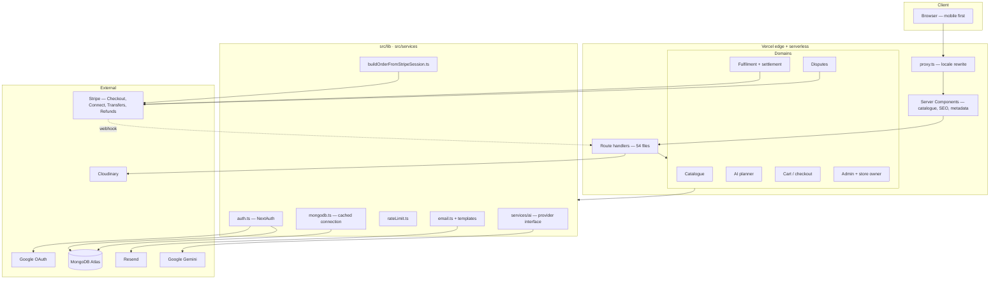
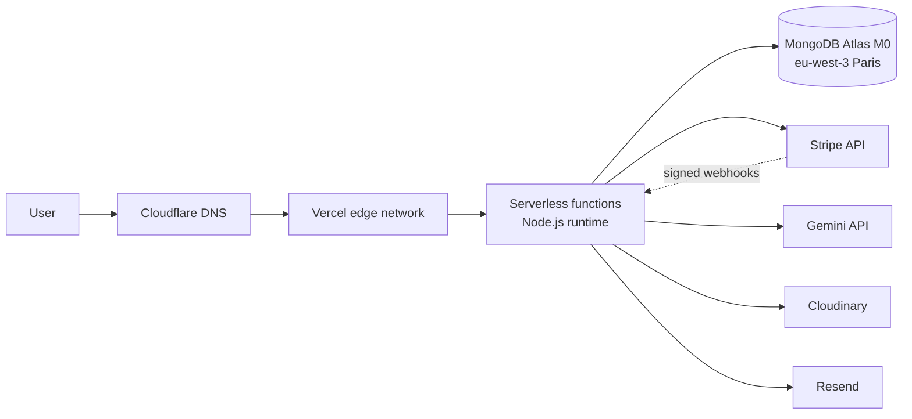

# 03 — Technical Analysis and System Architecture

> **SDLC stages:** 3. Technical analysis · 4. System architecture
> **Status:** DONE · **Baseline:** commit `3eb178a`, 2026-08-16
> **Update when:** the architecture itself changes — not for routine feature work.

---

## 1. Technical analysis

### 1.1 The governing constraint

One engineer operates this system, part-time, while completing a master's degree.
Every technical decision below is subordinate to that. The question asked of each
candidate technology was not "is this the best tool" but **"what happens to this
system when its only engineer does not look at it for three weeks?"** A technology
that requires attention to stay healthy — a self-managed database, a Kubernetes
cluster, a self-hosted queue — fails that test regardless of its merits.

### 1.2 Performance targets

| Target | Value | Rationale | Measured? |
|---|---|---|---|
| Largest Contentful Paint, catalogue pages, 4G | < 2.5 s | Persona P1 is on mobile data in the street | No |
| Time to First Byte, server-rendered pages | < 600 ms | Below Google's soft threshold for crawl quality | No |
| API p95, read endpoints | < 400 ms | Perceived instantaneity | No |
| AI generation, end to end | < 20 s | Above this the user assumes failure; the form shows explicit progress | No |
| Checkout redirect to Stripe | < 1.5 s | Hesitation at the payment step is expensive | No |

**None of these are instrumented.** They are design targets that informed choices
(server rendering, image CDN, indexed queries), not measured facts. Closing this
is specified in `10-OPERATIONS` §4.3.

### 1.3 Capacity model

The planning assumption is **100 users over five years** (`01-PRODUCT` §8.4, A-1),
with peak concurrency around 20.

| Resource | Ceiling | Headroom at planned load | Binds first? |
|---|---|---|---|
| Vercel serverless invocations | 100 k/month (Hobby) | ~50× | No |
| Atlas M0 storage | 512 MB | Catalogue + orders + itineraries well under 50 MB | No |
| Atlas M0 connections | 500 | Serverless connection reuse via a cached global promise keeps this low | Possibly, under a cold-start burst |
| Gemini free tier | **5 requests/minute** | Five simultaneous planner users exhaust it | **Yes — binds first** |
| Cloudinary free tier | 25 credits/month | Comfortable | No |
| Resend free tier | 3 000 emails/month | Comfortable | No |

The AI provider's rate limit binds long before anything else, and it binds at a
level a single busy afternoon could reach. It is mitigated by a one-shot retry and
a "high demand" message, but that only smooths a small burst. Enabling billing on
the Google Cloud project is a launch-gate item.

### 1.4 Cost model

| Service | Plan | Monthly | Note |
|---|---|---|---|
| Vercel | Hobby | €0 | **Terms exclude commercial use** — must move to Pro (~€20) before real traffic |
| MongoDB Atlas | M0, `eu-west-3` | €0 | No continuous backup at this tier |
| Cloudflare | Free DNS | €0 | |
| Cloudinary | Free | €0 | |
| Resend | Free | €0 | |
| Zoho Mail | Free | €0 | Human correspondence only |
| Google Gemini | Free tier | €0 | Billing required before launch |
| Stripe | Per transaction | Variable | ~1.5% + €0.25 EU cards, plus Connect fees |
| Domain `gowithporto.pt` | Annual | ~€1.50/mo | |

Pre-revenue fixed cost is effectively the domain. Post-launch, realistically
€25–35/month once the hosting plan and AI billing are corrected. This satisfies
NFR-12 and is the direct reason for the two most significant technical gaps in the
system: no database backups and no AI headroom. **Both are consequences of a
deliberate cost constraint, not oversights.**

### 1.5 Technology evaluation

| Decision | Chosen | Rejected | Reason |
|---|---|---|---|
| Application shape | Single Next.js app (App Router) | Separate Express API + React SPA | A network hop, a second deployment, a second dependency tree and CORS, in exchange for a separation one engineer never needs. The repo's dead `backend/` directory is the fossil of the rejected option |
| Rendering | Server Components with client islands | Full SPA | SEO is the only acquisition channel (C-5). An SPA would have required a rendering workaround from day one |
| Language | TypeScript | JavaScript | With no tests, the type checker is the *only* automated correctness signal in the project. This raises its value considerably |
| Database | MongoDB + Mongoose | PostgreSQL + Prisma | Honest assessment: **Postgres was arguably the better fit.** The domain is relational and money-shaped, and the absence of multi-document transactions is felt in the settlement path (`05-DATA` §5). Mongo was chosen for schema flexibility during rapid iteration and for existing familiarity. The `translations` overlay pattern is the one place the document model clearly paid |
| ODM | Mongoose | Native driver | Schema enforcement and index declaration in code |
| State | Redux Toolkit | Zustand / Context | Cart is the only meaningfully shared client state; RTK is heavier than needed. Kept for familiarity — a defensible but not optimal call |
| Styling | Tailwind CSS v4 | CSS Modules / styled-components | No context switch, no naming overhead, no runtime cost |
| Auth | NextAuth v4, JWT sessions | Custom sessions; Clerk/Auth0 | Custom auth is a reliable way to introduce vulnerabilities. Hosted auth adds cost and a third-party dependency on the login path |
| Payments | Stripe Checkout + Connect Express | Custom flow; PayPal | PCI scope reduction; Connect avoids regulated money transmission |
| AI | Gemini `gemini-3.7-flash`, pinned | GPT-4-class; `-latest` alias | Cost per generation; a pinned version cannot shift quota or behaviour under the system silently |
| i18n | Hand-rolled dictionaries + locale proxy | `next-intl` | Four flat dictionaries do not justify a framework. Reversible cheaply |
| Media | Cloudinary | S3 + CloudFront; Vercel Blob | Transformation and CDN included at zero cost |
| Email | Resend | Nodemailer + SMTP; SendGrid | Deliverability is a reputation problem; a purpose-built sender keeps app mail off the human mailbox's reputation |

---

## 2. Architecture style

**A modular monolith deployed as serverless functions.**

One Next.js application contains the full system. Internal structure is organised
by domain (`models/`, `services/`, `lib/`, feature-scoped component and route
folders) rather than by technical layer, so a feature's code sits together and a
future extraction along a domain seam remains possible. Deployment is a single
unit; there is no service mesh, no inter-service contract, and no distributed
transaction anywhere in the system.

**Why not microservices.** The standard argument for microservices is independent
team deployment. There is one team member. What microservices would actually
deliver here is distributed failure modes, eventual consistency in the money path,
and an operational surface one person cannot watch — every cost, none of the
benefit.

**Where the seams are, if extraction ever becomes right.** Three boundaries are
already clean enough to cut along: AI generation (behind `AIProvider`), settlement
and disputes (isolated in the fulfilment routes, keyed by `transfer_group`), and
the public catalogue (read-only, cacheable, no money). Trigger conditions are in
`11-EVOLUTION` §5.

---

## 3. Components



### 3.1 Component responsibilities

| Component | Responsibility | Key files |
|---|---|---|
| **Locale proxy** | Detect locale prefix, rewrite to canonical path, pass locale by header. Excludes `api`, `admin`, `store-owner` | `src/proxy.ts` |
| **Server Components** | Render catalogue and detail pages, emit metadata, `hreflang`, JSON-LD. Detail-page metadata and JSON-LD share one DB query via `React.cache` | `src/app/**/layout.tsx`, `page.tsx` |
| **Route handlers** | The entire backend. 54 route handlers (53 application endpoints plus the NextAuth catch-all) across six domains | `src/app/api/**/route.ts` |
| **Auth** | Three providers (Google, admin credentials, store-owner credentials); role and store identity carried on the JWT | `src/lib/auth.ts` |
| **Database access** | Cached Mongoose connection, reused across warm invocations | `src/lib/mongodb.ts` |
| **Order construction** | Single source of order shape and fee arithmetic, shared by both order-creation paths | `src/lib/buildOrderFromStripeSession.ts` |
| **Settlement** | Confirmation-gated Stripe transfers with per-item idempotency keys | `src/app/api/fulfill/[token]/confirm/route.ts` |
| **Dispute resolution** | Three-outcome refund/transfer execution, idempotent, single-resolution enforced | `src/app/api/admin/disputes/.../resolve/route.ts` |
| **AI service** | Provider-agnostic generation behind `AIProvider`; typed rate-limit error; prompt construction | `src/services/ai/*` |
| **Email** | Eight branded transactional templates over a shared layout | `src/lib/email.ts`, `src/lib/emailTemplates/*` |
| **Rate limiting** | In-memory fixed window, 5 attempts / 15 min, keyed by IP + target | `src/lib/rateLimit.ts` |

---

## 4. Data flow — the money path

The most important flow in the system, and the one that changed most recently.

```mermaid
sequenceDiagram
    participant Buyer
    participant App
    participant Stripe
    participant DB
    participant Handler
    participant Seller

    Buyer->>App: POST /api/payments/checkout
    App->>App: pre-generate orderId (ObjectId)
    App->>Stripe: create Checkout Session<br/>transfer_group = orderId<br/>NO application_fee, NO transfer_data
    Stripe-->>Buyer: hosted payment page
    Buyer->>Stripe: pays
    Note over Stripe: full amount lands on the<br/>PLATFORM balance
    par webhook path (authoritative)
        Stripe->>App: checkout.session.completed (signed)
        App->>DB: create Order (unique stripeSessionId)
        App->>DB: decrement stock
        App->>Buyer: confirmation email
    and browser path (fast UI)
        Buyer->>App: POST /api/orders/confirm
        App->>DB: findOne by stripeSessionId → create if absent
    end
    Note over DB: whichever arrives first wins;<br/>the other returns the existing order

    Seller->>App: PUT .../dispatch (per item)
    App->>Buyer: dispatched / ready-for-pickup email

    Buyer->>Handler: presents QR (fulfillmentToken)
    Handler->>App: POST /api/fulfill/[token]/confirm { pin }
    App->>App: bcrypt-compare PIN against Store.fulfillmentPinHash
    App->>Stripe: transfers.create<br/>idempotencyKey transfer:{orderId}:{itemId}<br/>source_transaction = chargeId
    Stripe-->>Seller: seller share
    App->>Stripe: delivery-fee transfer (once per order)
    App->>DB: item → delivered / picked_up
```

### 4.1 Why the model changed

The previous design split money **at checkout**, using Stripe's
`application_fee_amount` with `transfer_data.destination`. Stripe performed the
split atomically, which was elegant and — for a marketplace shipping physical
goods — wrong: **the seller was paid the moment the card cleared, before the buyer
had received anything.** When a buyer legitimately complained, the funds were
already in the seller's account and outside platform control. Recovering them
required either the seller's cooperation or a transfer reversal against a balance
that might no longer hold it.

The current model keeps the full charge on the platform balance and releases the
seller's share only on confirmed handover, with `transfer_group = orderId` tying
every movement back to one order. This is escrow in the practical sense while
remaining inside Stripe's regulated rails — the platform never holds funds outside
Stripe and never touches a seller's bank details.

**The cost:** the platform now carries balance it must eventually move, and a
handover that is never confirmed leaves money unsettled indefinitely. There is no
automatic timeout that releases or refunds a stale item. That is an acknowledged
gap (`04-DOMAIN` §6).

### 4.2 Idempotency, layer by layer

| Layer | Mechanism |
|---|---|
| Order creation | Unique sparse index on `Order.stripeSessionId`; both paths check first, and the webhook additionally catches duplicate-key error `11000` |
| Item settlement | Stripe idempotency key `transfer:{orderId}:{itemId}` |
| Delivery-fee settlement | Idempotency key `transfer:{orderId}:deliveryFee`, plus a `deliveryFeeTransferred` boolean |
| Dispute resolution | State guard — an item not in `issue_reported` is rejected **before any Stripe call** — plus per-outcome idempotency keys |
| Webhook redelivery | Existing-order lookup returns success without side effects |

The ordering in the dispute guard is the detail that matters: rejecting on state
*before* calling Stripe means a double-submitted resolution cannot produce a
duplicate refund even in the window before the database write lands.

---

## 5. Deployment topology



| Concern | Choice | Note |
|---|---|---|
| Registrar | DNS.PT | Registration only — no zone editor, hence Cloudflare |
| DNS | Cloudflare, free | |
| Hosting | Vercel, Hobby | Must become Pro before commercial traffic |
| Region | Atlas `eu-west-3` (Paris) | EU data residency; nearest region to Porto |
| TLS | Vercel-managed | |
| Environments | Production + local only | **No staging** — see `10-OPERATIONS` §3 |
| Secrets | Vercel environment variables; `.env.local` locally | Not committed; `05-DATA` and `07-SECURITY` §5 |

---

## 6. Quality attributes

### 6.1 Scalability

Compute scales automatically and is not the constraint. The binding limits are, in
order: the Gemini rate ceiling, the Atlas M0 connection pool under cold-start
bursts, and Atlas M0 storage. Each has a documented trigger and remedy in
`11-EVOLUTION` §5. **Horizontal scaling of the application requires no work; every
scaling action in this system is a managed-service tier change.** That is the
intended property.

The one exception is `src/lib/rateLimit.ts`, which holds state in a module-level
`Map`. Under serverless this is per-instance and resets on cold start, so it is
not a correct distributed limiter. It stops naive brute-force scripts, which is
what it was built for, and its limitation is recorded rather than hidden (ADR
2026-08-03).

### 6.2 Availability and fault isolation

| Dependency fails | Consequence | Isolated? |
|---|---|---|
| Gemini | Planner returns a "high demand" message; storefront, checkout and fulfilment unaffected | Yes |
| Cloudinary | Images break; pages render and checkout works | Partial |
| Resend | Users receive no email. **Nothing surfaces the failure** | No — worst-isolated failure |
| Stripe | No new sales, no settlement; catalogue browsing works | Yes |
| MongoDB Atlas | Total outage | No — single point of failure |
| Vercel | Total outage | No |

Two single points of failure (Atlas, Vercel) are accepted: both are managed
services with better availability records than anything one person could operate,
and removing either means multi-region complexity that fails the §1.1 test.

The Resend row is the uncomfortable one. A silent email failure means a buyer pays
and hears nothing, and the operator learns from a complaint. This is an
observability gap, not an architectural one, and is specified in
`10-OPERATIONS` §4.3.

### 6.3 Reliability and fault tolerance

| Mechanism | Where |
|---|---|
| Dual-path order creation — webhook authoritative, browser call for immediate UI | `webhooks/stripe`, `orders/confirm` |
| Both paths share one builder, so shape and fee logic cannot drift | `buildOrderFromStripeSession.ts` |
| Signature verification on every webhook | `stripe.webhooks.constructEvent` |
| Idempotency keys on every money-moving Stripe call | §4.2 |
| Transfer failures recorded as `transferPending` + `transferError` rather than lost | fulfilment confirm route |
| Checkout succeeds even when the store is not Connect-onboarded; settlement marked pending | BR-11 |
| Self-healing Connect status check, because `account.updated` needs a separately-registered Connect webhook endpoint | `GET /api/store-owner/connect` |
| AI charged only after successful generation | `api/ai/preview` |
| Route and global error boundaries; branded 404; offline banner | `app/error.tsx`, `global-error.tsx`, `not-found.tsx`, `ConnectivityBanner` |

**What is absent:** no retry queue for failed transfers — a `transferPending`
item requires manual operator action; no dead-letter handling for failed webhooks
beyond Stripe's own retry schedule; no circuit breaker on any external call; no
automated reconciliation between Stripe's ledger and the `Order` collection.

---

## 7. Architecture decisions

Every non-obvious decision is recorded in [`DECISIONS.md`](DECISIONS.md) with the
alternatives considered and the reason for the choice. Decisions are append-only
and dated; a superseded decision is annotated, never edited away.

The decisions that most shape this architecture:

- Single Next.js application rather than a separate Express backend
- Stripe Connect Express rather than any custom payout mechanism
- Confirmation-gated settlement rather than checkout-time splitting *(2026-08-16 — supersedes the earlier split model)*
- Per-store commission rate, snapshotted onto each order
- Commission on product subtotal only, never on the delivery fee
- In-memory rate limiting now, Upstash Redis at a defined trigger
- Referral partners kept deliberately manual, with no payment integration
- Removal of two unauthenticated order-creation endpoints
- Restricted, test-mode-only Stripe key for AI tool access

---

## Trade-offs recorded

**Monolith over services.** Accepts that a runaway AI generation shares a
deployment with checkout. Buys an architecture one person can hold in their head
and deploy in ninety seconds. At this scale the trade is not close.

**MongoDB over PostgreSQL.** The most questionable choice in the system, and it is
recorded as such rather than defended. A money domain with per-item settlement,
refunds and transfers wants ACID transactions across documents. The current design
compensates with idempotency keys, state guards and Stripe as the external source
of truth — which works, but is more machinery than `BEGIN`/`COMMIT` would have
been. Migration is not planned: the compensating mechanisms are built and tested
in production use, and rewriting the persistence layer of a working payment system
to gain elegance is a poor risk trade.

**Serverless over a long-running server.** Costs correct in-process rate limiting
and cheap background work — both of which the system now feels. Buys zero
operational maintenance, which is the whole point (§1.1).

**Type checking as the only automated safety net.** With no test suite,
TypeScript's compiler is doing work it was never meant to do alone. It catches
shape errors and catches nothing about whether the commission arithmetic is
correct. This is the gap that `09-QUALITY` exists to close.
