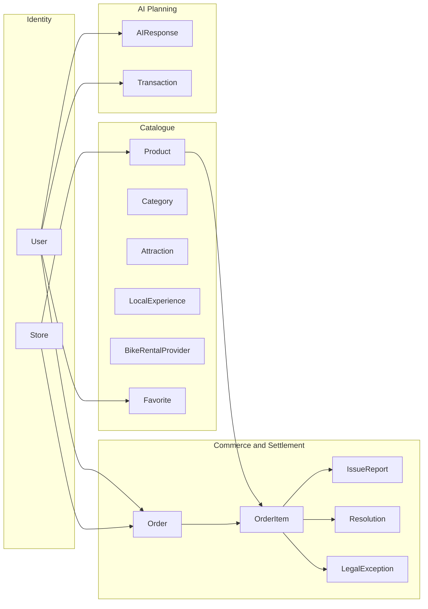
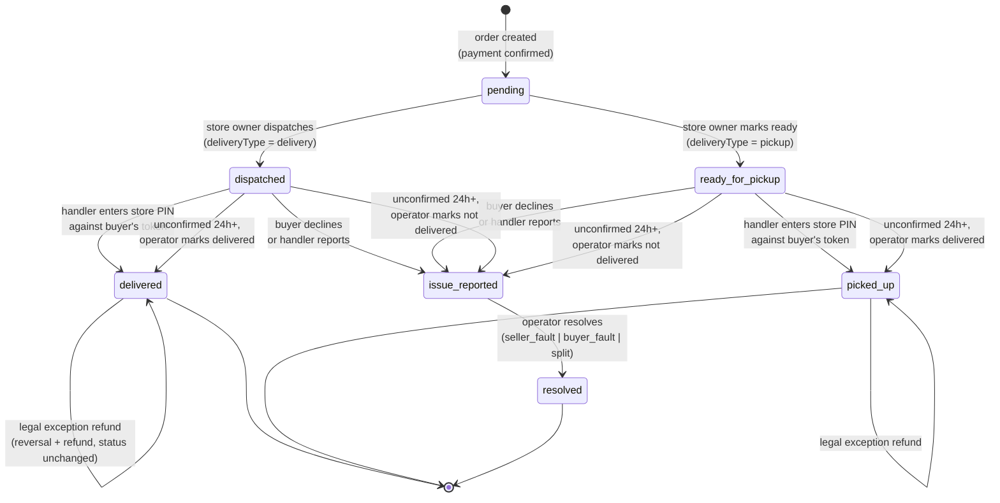
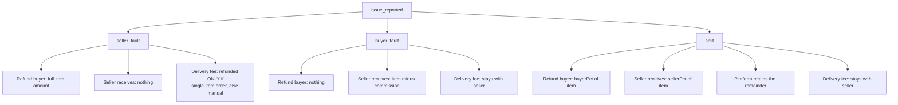

# 04 — Domain Model and Business Logic

> **SDLC stage:** 5. Domain / Business logic
> **Status:** DONE · **Baseline:** commit `3eb178a`, 2026-08-16
> **Update when:** an entity, a state, or a money rule changes.

This document describes the part of the system with genuine design content. The
catalogue and the AI planner are conventional; **the settlement domain — escrowed,
per-item, confirmation-gated, with three-way dispute resolution — is where the
engineering is.** A reader with limited time should start at §3.

---

## 1. Bounded contexts

Four contexts inside one deployment. They share a database and a session, but not
their invariants.



| Context | Owns | Invariant it protects |
|---|---|---|
| **Identity** | `User`, `Store` | One account per email; a store's login credential is distinct from its fulfilment credential |
| **Catalogue** | `Product`, `Category`, `Attraction`, `LocalExperience`, `BikeRentalProvider`, `Favorite` | Slugs are unique and stable; a favourite is unique per user, type and item |
| **Commerce and Settlement** | `Order` and its item sub-documents | **Money is never created or destroyed**; every euro is refunded, transferred, or retained as commission, exactly once |
| **AI Planning** | `AIResponse`, `Transaction`, credit fields on `User` | A credit is consumed only for a generation that succeeded |

The Commerce context is the only one with non-trivial invariants, and it is the
only one whose rules are enforced in more than one place.

---

## 2. Entities and aggregates

### 2.1 Aggregates

There are two, and identifying them correctly is what makes the settlement logic
tractable.

**`Order` — the settlement aggregate.** The aggregate root. Items are
sub-documents with no independent identity outside their order, because every
money rule needs order-level context: the commission rate snapshot, the delivery
fee, the charge ID, the transfer group. An item cannot be reasoned about alone.
All state transitions load, mutate and save the whole order document, which gives
single-document atomicity — the closest thing to a transaction available on this
database (`05-DATA` §5).

**`Store` — the seller aggregate.** Owns its products, its commission rate, its
Connect account and its fulfilment PIN. A store's data is never visible to another
store; every store-owner route re-derives the caller's product set from
`session.user.storeId` rather than trusting a client-supplied identifier.

### 2.2 Entity reference

| Entity | Identity | Notable fields | Lifecycle |
|---|---|---|---|
| `User` | `email` (unique) | `role` (USER/ADMIN/STORE_OWNER), `credits`, `freeUsed` | Created on first Google sign-in or by admin seed script |
| `Store` | `storeCode` (unique), `slug` (unique) | `passwordHash`, `fulfillmentPinHash`, `commissionRate`, `stripeAccountId`, `stripeOnboardingComplete`, `deliveryFee` | Created by the operator; Connect onboarding completed by the owner |
| `Product` | `slug` (unique) | `variants[]`, `quantity`, `storeId`, `translations` | Created by store owner; soft-deleted via `active` |
| `Order` | `_id`, plus unique sparse `stripeSessionId` | `items[]`, `commissionRateSnapshot`, `paymentIntentId`, `chargeId`, `deliveryFee`, `deliveryFeeTransferred` | Created once per paid Stripe session |
| `OrderItem` | `_id` within the order | `fulfillmentToken` (unique sparse), `fulfillmentStatus`, `transferId`, `issueReport`, `resolution`, `legalException` | Follows the state machine in §3 |
| `AIResponse` | `_id` | `userEmail`, `prompt`, `response` | Immutable once written |
| `Transaction` | `_id` | `stripeSessionId`, `creditsAdded`, `amount` | Immutable — the credit purchase ledger |
| `Favorite` | compound unique (`userEmail`, `itemType`, `itemId`) | polymorphic `itemType` | Toggled |
| `Attraction`, `LocalExperience` | `slug` (unique) | `translations`, `active`, `order` | Operator-managed |
| `GlobalConfig` | `key` (unique) | `value` (Mixed) | Key-value store for AI and platform settings |

### 2.3 Deliberate denormalisation

Three cases, each with a reason:

| Denormalised | Onto | Why |
|---|---|---|
| `commissionRateSnapshot` | `Order` | A later rate change must never alter what a historical order owed (BR-4). Reading the rate live from `Store` would silently rewrite history |
| Item `title`, `price`, `image`, `variantName` | `OrderItem` | An order is a record of what was bought at the price agreed. If the product is edited or deleted, the order must still read correctly |
| `storeStripeAccountId` | `Order` | Reconciliation must survive a store changing or losing its Connect account |

This is the standard "orders are immutable records, not live joins" pattern, and
it is the correct instinct in any commerce domain.

---

## 3. The fulfilment state machine

Every order item moves through this independently. **Settlement is per item, not
per order** (BR-6): a three-item order can have one item paid out, one in dispute
and one still awaiting dispatch.



### 3.1 State reference

| State | Meaning | Money position | Transitions out |
|---|---|---|---|
| `pending` | Paid, not yet dispatched | Full amount on platform balance | `dispatched`, `ready_for_pickup` |
| `dispatched` | On its way; token issued, QR active | Held | `delivered`, `issue_reported` |
| `ready_for_pickup` | Awaiting collection; token issued | Held | `picked_up`, `issue_reported` |
| `delivered` | Handover confirmed (delivery) | **Seller share transferred** | terminal (legal exception possible) |
| `picked_up` | Handover confirmed (pickup) | **Seller share transferred** | terminal (legal exception possible) |
| `issue_reported` | Buyer or handler raised a problem; settlement frozen | Held, frozen | `resolved` |
| `resolved` | Operator adjudicated | Refunded / transferred / split per outcome | terminal |

### 3.2 Transition guards

Each guard is enforced server-side and returns before any external call.

| Transition | Guard |
|---|---|
| → `dispatched` / `ready_for_pickup` | Caller has role `STORE_OWNER`; the item's product belongs to the caller's store; current status is exactly `pending`; a non-empty ETA string is supplied; the order has a `paymentIntentId` (legacy orders are routed to the old shipping flow instead) |
| → `delivered` / `picked_up` | Token matches an item currently in `dispatched` or `ready_for_pickup`; submitted PIN bcrypt-matches the store's `fulfillmentPinHash`; rate limit not exceeded |
| → `delivered` / `picked_up` (operator, stale item) | Caller has role `ADMIN`; item is in `dispatched` or `ready_for_pickup` — no 24h check re-enforced server-side beyond the admin panel only surfacing items past that age |
| → `issue_reported` (operator, stale item) | Caller has role `ADMIN`; item is in `dispatched` or `ready_for_pickup`; `issueReport.reportedBy` recorded as `"system"` to distinguish from a buyer/handler report |
| → `issue_reported` (buyer) | Authenticated session owns the order; reason code is in the allowed set; item is in `dispatched` or `ready_for_pickup` |
| → `issue_reported` (handler) | Token matches an item in `dispatched` or `ready_for_pickup`; reason code in the allowed handler set |
| → `resolved` | Caller has role `ADMIN`; **item status is exactly `issue_reported`** — checked before any Stripe call; outcome is valid; split percentages sum to ≤ 100 |
| legal exception | Caller has role `ADMIN`; item is `delivered` or `picked_up`; a transfer exists; no legal exception already processed; amount does not exceed what was transferred |

### 3.3 Two properties worth pointing out

**Neither party can complete a handover alone.** The buyer holds the token; the
store holds the PIN. A buyer cannot confirm receipt of something never delivered,
and a seller cannot self-confirm to release their own funds. The two secrets are
held by parties with opposing incentives, which is what makes the confirmation
meaningful rather than ceremonial.

**Failure is never silent, but it is also never automatic.** A missing token, a
wrong PIN or an expired state returns a deliberately generic message that does not
reveal whether the token ever existed. But a transfer that fails at Stripe is
recorded as `transferPending` with the error text and left for the operator — the
system does not retry, and it does not pretend the money moved.

---

## 4. Money settlement workflow

### 4.1 The rules

| Rule | Statement |
|---|---|
| BR-3 | Commission applies to the **product subtotal only**. The delivery fee is the seller's pass-through cost and is never commissioned |
| BR-4 | The commission rate is snapshotted onto the order at creation |
| BR-5 | Seller funds move only on confirmed handover |
| BR-6 | Settlement is per item |
| BR-11 | A store without completed Connect onboarding does not block checkout; settlement is marked pending |

### 4.2 The arithmetic

At order creation, `platformFeeAmount` and `storeOwnerAmount` are computed and
stored — but these are **display estimates only**. The authoritative amount is
recomputed per item at the moment of transfer:

```
sellerCents = round( item.price × item.quantity
                     × (1 − commissionRateSnapshot / 100)
                     × 100 )
```

The delivery fee transfers separately, once per order, at 100% to the seller,
guarded by the `deliveryFeeTransferred` boolean.

Recomputing rather than reading the stored estimate matters because an order can
settle item by item over days, with disputes changing what each item is worth.
A single stored total cannot represent that; the per-item computation can.

### 4.3 Reconciliation

Every money movement carries `transfer_group = orderId`, set on the PaymentIntent
at checkout. In the Stripe dashboard, one order's charge, transfers, refunds and
reversals group together. This is the only reconciliation mechanism in the system
— **there is no automated comparison between Stripe's ledger and the `Order`
collection.** An operator can reconcile by hand, per order, and at 100 users that
is adequate. It is recorded as a gap in §6.

---

## 5. Dispute workflow

### 5.1 Reporting

Two parties can raise an issue, with different vocabularies reflecting what each
can actually observe:

| Reporter | Reason codes |
|---|---|
| **Buyer** (from `/dashboard/orders`) | `item_not_received`, `item_defective_or_wrong`, `no_longer_needed`, `other` |
| **Handler** (from `/fulfill/[token]`) | `buyer_not_present`, `wrong_address`, `buyer_refused`, `item_issue`, `other` |

A free-text note is accepted and truncated to 500 characters. The item freezes in
`issue_reported`; no transfer occurs.

### 5.2 Resolution

The operator picks one of three outcomes from `/admin/disputes`.



| Outcome | Buyer | Seller | Platform | Delivery fee |
|---|---|---|---|---|
| `seller_fault` | Full item refund | 0 | 0 — commission waived | Refunded if single-item order (BR-9), else escalated to manual |
| `buyer_fault` | 0 | Item minus commission | Commission | Kept by seller (BR-10) |
| `split` | `buyerPct` of item | `sellerPct` of item | Remainder | Kept by seller |

Three details in this table are deliberate design, not defaults:

**The platform waives its own commission on seller fault.** It would be
arithmetically possible to refund the buyer while retaining the platform's cut
from the seller's side. Refusing to earn on a failed transaction is a trust
decision.

**`split` lets the platform retain the remainder.** If the operator sets 40%
buyer and 40% seller, 20% stays with the platform. This is a real lever and it is
open to abuse by the operator; it is documented here precisely so that it is
visible rather than buried.

**Multi-item delivery-fee attribution is refused, not guessed.** When one item of
three is seller-fault, no principled rule says what share of a single order-level
delivery fee should be refunded. Rather than invent one, the code handles only the
unambiguous single-item case and leaves the rest to a human (BR-9). *Declining to
automate an ambiguous rule is a design decision, and it is the right one — an
invented rule would produce confidently wrong refunds.*

### 5.3 Resolution safety

| Property | Mechanism |
|---|---|
| Resolve exactly once | Status must be exactly `issue_reported`; checked **before** any Stripe call (BR-7) |
| No duplicate refund on retry | Idempotency key `refund:{orderId}:{itemId}` (and `:split`) |
| No duplicate transfer on retry | Idempotency key `transfer:{orderId}:{itemId}` (and `:split`) |
| Delivery fee never double-moves | `deliveryFeeTransferred` boolean, plus key `transfer:{orderId}:deliveryFee` |
| Cannot pay an un-onboarded seller | `buyer_fault` and `split` reject with 400 when the store has no working Connect account |
| Both parties informed | Resolution email sent after the state is persisted |
| Full audit trail | The `Resolution` sub-document records outcome, amounts, Stripe IDs, resolver identity, timestamp and notes |

### 5.4 The legal exception path

A separate, deliberately manual route exists for the case the dispute flow cannot
handle: **a buyer exercising a statutory right after the item was already
confirmed delivered and the seller already paid.** Under EU consumer law a buyer
may withdraw within 14 days of receipt for most distance sales, and may claim for
non-conformity well beyond that — neither of which fits a state machine that
treats `delivered` as terminal.

The path pulls funds back before refunding the card:

```
POST /api/admin/orders/[orderId]/items/[itemId]/legal-refund
  guard: ADMIN · item delivered or picked_up · a transfer exists
       · no legal exception already processed
       · amount ≤ what was transferred
  → stripe.transfers.createReversal  (idempotency: reversal:{transferId})
  → stripe.refunds.create
  → record LegalException { reason, amount, transferReversalId, refundId,
                            processedBy, processedAt }
```

The item's `fulfillmentStatus` is deliberately **not** changed. The handover did
happen; the goods were delivered; what followed is a separate legal event recorded
alongside the fulfilment history rather than overwriting it. Conflating the two
would corrupt the fulfilment record for the sake of a status label.

This route is admin-only, low-volume and intentionally unautomated. It is the one
place in the system where the correct answer depends on law rather than on rules
the code can encode — see `12-GOVERNANCE` §2.

---

## 6. Known domain gaps

Stated plainly, because a reader will find them.

| Gap | Consequence | Why it stands |
|---|---|---|
| ~~No timeout on unconfirmed handover~~ **Implemented** | An item dispatched/ready-for-pickup and unconfirmed for 24h+ now surfaces in `/admin/disputes` as a "stale" row (checked once daily via Vercel Cron, `/api/cron/check-stale-fulfillments` — detection is within ~24-48h of the threshold, not exact, given the once-daily Hobby-plan cron limit). The operator picks up manually — "Mark Delivered" (normal payout) or "Not Delivered" (promotes to a regular `issue_reported` dispute for seller_fault/buyer_fault/split adjudication) — no automatic side is picked. An immediate Resend email now also fires to the admin inbox for every dispute (reported or auto-detected), closing the "operator has to notice on their own" gap this row used to describe. | — |
| **No automated Stripe ↔ database reconciliation** | A transfer that succeeded at Stripe but failed to persist locally leaves the two ledgers disagreeing, and nothing detects it | `transfer_group` makes manual reconciliation possible. Automation is warranted above roughly 50 orders/month |
| **`transferPending` has no retry** | A failed transfer waits for the operator to notice — and nothing alerts them | Depends on `10-OPERATIONS` §4.3 |
| **Multi-store carts are not supported** | Checkout takes `products[0].storeId` for the whole cart. A cart mixing two stores would attribute the entire order to one of them | Genuine defect at the boundary. The UI does not currently offer cross-store carts, so it is unreachable — but it is unguarded rather than prevented. **Should be an explicit rejection, and is in `TODO.md`** |
| **Stock decrements without a concurrency guard** | `$inc` is atomic per document, but nothing prevents overselling the last unit to two simultaneous buyers | Accepted at planned concurrency; a conditional update on `quantity >= n` is the fix |
| **Refund-then-restock is not modelled** | A seller-fault refund does not return the item to stock | Small catalogue; operator adjusts manually |

---

## Trade-offs recorded

**Per-item settlement over per-order.** Substantially more state to manage — seven
states, per-item tokens, per-item transfers, per-item disputes — in exchange for a
model that matches reality. A buyer whose second item was damaged should not have
their first item's payment frozen. The complexity is real and it is justified.

**Escrow over instant payout.** Sellers wait for their money; a marketplace with
instant payout is more attractive to supply. In exchange the platform can actually
honour a refund, which is both a consumer-protection obligation and the difference
between a marketplace and a payment forwarder.

**Store-level PIN over per-handler credentials.** Weaker attribution — the system
knows *a* holder of the store's PIN confirmed, not *who*. Bought a flow a courier
completes in fifteen seconds without an account, which is the difference between
settlement happening and settlement not happening.

**Refusing to automate ambiguous rules.** Multi-item delivery-fee attribution and
handover timeouts are both left to a human. This does not scale, and it is
correct at this scale: an invented rule applied to someone's money is worse than
an operator's judgement applied slowly.
