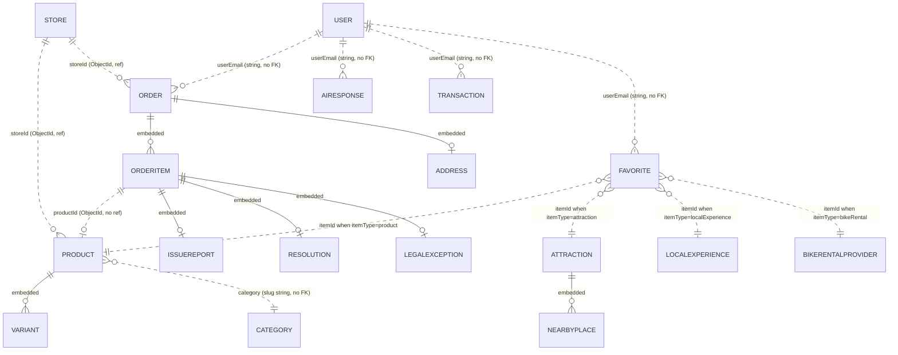

# 05 — Data Engineering

> **SDLC stage:** 6. Data engineering
> **Status:** PARTIAL — schema and access patterns solid; backup, retention and migration versioning are gaps
> **Baseline:** commit `3eb178a`, 2026-08-16
> **Update when:** a schema or a data-lifecycle policy changes.

---

## 1. Why MongoDB — and an honest reassessment

**Status: PARTIAL.** The choice works. It was not obviously the right one.

The store is MongoDB Atlas, free tier `M0`, `Cluster0` in `eu-west-3` (Paris), reached through
Mongoose `^9.1.2` from a Next.js `16.1.1` App Router monolith. Two database users exist:
`atlas_admin` (unused by the application) and `gowithporto_app`, scoped `readWrite` on the
`gowithporto` database only — see `03-ARCHITECTURE` §2 and `07-SECURITY` §5. This document supersedes
`docs/DATABASE.md`, which predates the dispute-resolution and payout-gating fields.

| Driver | Detail | Held up? |
|---|---|---|
| Cost | M0 is free; there is no equivalent free managed Postgres in the same account family. 100 users over five years does not justify a paid tier | Yes |
| Single-operator velocity | No migration step between editing a schema and storing the new field. One person, no DBA | Yes |
| Schema churn in content models | `Attraction` and `LocalExperience` grew organically to 20 and 24 fields. Adding `durationCategory` or `cancellationPolicy` cost nothing | Yes |
| Localisation overlay | `translations` is `Schema.Types.Mixed`, an arbitrarily nested per-locale document | Yes, decisively |
| Money domain fit | Orders, transfers, refunds, commission splits | No |

### 1.1 Where the document model paid

The `translations` field on `Product`, `Attraction` and `LocalExperience` is the one place the
document model genuinely earned its keep. Each document carries an optional overlay shaped
`{ fr: { title, description, … }, es: { … }, pt: { … } }`. `src/lib/localizeContent.ts` merges it
onto the base English fields field-by-field, falls back to English per field where a translation is
missing, and strips `translations` from the result so the API response shape is locale-independent.
The translatable field list differs per collection — two fields for `Product`, eight each for the
other two — and the writer uses `$set` on dotted paths such as `translations.fr`, so partial
backfills are idempotent and re-runnable. In a relational schema this is a `product_translations`
table with a composite key, a join on every read, a nullable column per translatable field, and a
migration each time a field becomes translatable. Here it is one embedded object and no join.

### 1.2 Where PostgreSQL would have been better

The project's own architecture note concedes this, and the concession is correct. The money domain
is relational and carries invariants MongoDB does not help enforce.

| Need | Postgres | What the code does instead |
|---|---|---|
| Multi-row atomicity across order and payout ledger | `BEGIN … COMMIT` | Nothing. Order mutation and Stripe call are separate steps (§5) |
| Referential integrity on `Order.storeId`, `Product.storeId`, `Favorite.itemId` | `FOREIGN KEY … ON DELETE` | Nothing. Dangling references are possible and reachable today (§3.1) |
| Exact decimal money | `NUMERIC(10,2)` | JavaScript doubles rounded with `Math.round(x * 100) / 100` at write time |
| Uniqueness under concurrency on `Transaction.stripeSessionId` | `UNIQUE` | A read-then-write check, no index, no constraint (§4.2) |
| Reporting joins for admin revenue | `GROUP BY` with joins | Three separate `$group` aggregations joined in Node by `Map` on `userEmail` |

The `Order` document is the mitigation: because an entire order — items, address, transfer ids,
issue reports, resolutions — lives in one document, most money mutations are single-document and so
atomic (§5). That is deliberate and it works, but it compensates for a constraint the relational
engine would have removed. Recorded as a live regret in `11-EVOLUTION` §5: at meaningful volume the
money collections belong in Postgres; the content collections can stay where they are.

---

## 2. Collection reference

Twelve models under `src/models/`. Collection names are Mongoose's default pluralisation. Every
schema uses `{ timestamps: true }`, giving `createdAt` and `updatedAt`.

### 2.1 `users` — `src/models/User.ts`

| Field | Type | Constraint | Purpose |
|---|---|---|---|
| `email` | String | `required`, `unique` | Natural key. Every other collection references users by this string, not by `_id` |
| `name`, `image` | String | — | Display name and avatar URL (Google or Cloudinary) |
| `password` | String | `select: false` | bcrypt hash, admin credential login only; excluded from queries by default |
| `role` | String | enum `USER` \| `ADMIN` \| `STORE_OWNER`, default `USER` | Authorisation |
| `credits` | Number | default `0` | AI itinerary credits |
| `freeUsed` | Boolean | default `false` | First AI generation is free |

### 2.2 `stores` — `src/models/Store.ts`

The only model with an explicit `IStore extends Document` interface.

| Field | Type | Constraint | Purpose |
|---|---|---|---|
| `name`, `location` | String | `required` | Public display |
| `slug` | String | `required`, `unique` | URL key |
| `storeCode` | String | `required`, `unique` | Store-owner login identifier |
| `passwordHash` | String | `required` | bcrypt hash for store-owner login |
| `fulfillmentPinHash` | String | optional | bcrypt hash of the PIN given to delivery/pickup staff — deliberately not the login `storeCode` |
| `role` | String | default `"STORE_OWNER"` | Session role |
| `deliveryFee` | Number | default `0` | Flat per-order delivery fee, kept whole by the store |
| `stripeAccountId` | String | optional | Stripe Connect account id |
| `stripeOnboardingComplete` | Boolean | default `false` | Set from the `account.updated` webhook when `charges_enabled && payouts_enabled` |
| `commissionRate` | Number | default `10` | Percent kept by the platform. Per-store, not global |
| `active` | Boolean | default `true` | Visibility flag |

### 2.3 `products` — `src/models/Product.ts`

| Field | Type | Constraint | Purpose |
|---|---|---|---|
| `title`, `description`, `category` | String | — | Content. `category` is a free string, not a reference |
| `slug` | String | `unique` | URL key |
| `price`, `quantity` | Number | `quantity` default `0` | Base price in EUR and base stock |
| `images` | [String] | — | Cloudinary URLs |
| `variants` | [VariantSchema] | — | Embedded variants |
| `storeId` | ObjectId | `ref: "Store"` | Owning store |
| `active` | Boolean | default `true` | Listing visibility filter |
| `translations` | Mixed | default `{}` | Per-locale overlay for `title`, `description` |

**`VariantSchema`** (embedded) — `name`, `image` (String), `price` (Number), `quantity` (Number,
default `0`). It retains an auto `_id`, which is load-bearing: `Order.items[].variantId` stores that
id as a string and `buildOrderFromStripeSession` matches on it.

### 2.4 `categories` — `src/models/Category.ts`

`name` (String), `slug` (String, `unique`), `image` (String). Note the coupling: `Product.category`
holds a slug string with no reference to this collection, so a product may carry a category no
`Category` document defines.

### 2.5 `orders` — `src/models/Order.ts`

The aggregate root. See `04-DOMAIN` §3 for the fulfilment state machine this schema encodes.

| Field | Type | Constraint | Purpose |
|---|---|---|---|
| `_id` | ObjectId | pre-allocated | Generated in `/api/payments/checkout` and sent to Stripe as `metadata.orderId` and `transfer_group`, so the id exists before the document does |
| `userEmail` | String | — | Buyer. No `ref` to `User` |
| `storeId` | ObjectId | `ref: "Store"` | Selling store; populated in admin routes |
| `stripeSessionId` | String | `unique`, `sparse` | Idempotency key shared by the webhook and the confirm route |
| `paymentIntentId`, `chargeId` | String | — | Required for refunds and `source_transaction` on transfers |
| `commissionRateSnapshot` | Number | — | Commission frozen at purchase; all later payout maths uses this, not the store's current rate |
| `total` | Number | — | Charged amount, from `session.amount_total / 100` |
| `deliveryType`, `deliveryFee` | String enum `pickup` \| `delivery`, Number default `0` | — | Fulfilment mode and fee. Commission is charged on products only |
| `deliveryFeeTransferred`, `deliveryFeeTransferId`, `deliveryFeeTransferError` | Boolean default `false`, String, String | — | Guard and outcome so the delivery fee transfers at most once |
| `items` | [ … ] | inline subdocument array, auto `_id` per item | See below |
| `platformFeeAmount`, `storeOwnerAmount` | Number | — | Informational estimates at creation; actual transfers are recomputed per item at confirmation |
| `storeStripeAccountId`, `cardBrand`, `cardLast4` | String | — | Connected-account snapshot; card details for display only |
| `address` | AddressSchema | — | Delivery address |
| `status` | String | default `"paid"` | Order-level status, a free String with no enum |

**`items[]`** (embedded, each with an auto `_id` used as `itemId` in fulfilment routes):

| Field | Type | Constraint | Purpose |
|---|---|---|---|
| `productId` | ObjectId | no `ref` | Untyped reference; `.populate()` would not work as written |
| `variantId`, `variantName`, `title`, `price`, `quantity`, `image` | String/Number | — | Line snapshot, decoupled from later product edits |
| `fulfillmentToken` | String | `index: { unique: true, sparse: true }` | 24 random bytes, base64url, embedded in the buyer-held QR link. Regenerated on dispatch |
| `fulfillmentStatus` | String | enum of 7, default `pending` | `pending`, `dispatched`, `ready_for_pickup`, `delivered`, `picked_up`, `issue_reported`, `resolved` |
| `etaText`, `dispatchedAt`, `confirmedAt` | String/Date | — | Fulfilment timeline |
| `transferId`, `transferAmount`, `transferredAt` | String/Number/Date | — | Payout record |
| `transferPending`, `transferError` | Boolean/String | — | Set when the Stripe transfer failed or the store is not Connect-onboarded |
| `issueReport`, `resolution`, `legalException` | embedded schemas | — | Dispute opened, closed, and post-payout admin exception |

**`AddressSchema`** — `name`, `street`, `city`, `postalCode`, `country`, all String. It does not set
`_id: false`, so every stored address carries a redundant ObjectId. The three dispute schemas all do
set `_id: false`:

- **`IssueReportSchema`** — `reportedBy` (enum `buyer` \| `handler`), `reasonCode` (String, validated
  against a route-level allow-list rather than in the schema), `note` (String, truncated to 500 chars
  at the route), `reportedAt` (Date).
- **`ResolutionSchema`** — `outcome` (enum `seller_fault` \| `buyer_fault` \| `split`),
  `buyerRefundAmount`, `sellerAmount`, `platformAmount` (Number), `deliveryFeeHandling` (enum
  `refunded` \| `kept_by_seller` \| `not_applicable`), `stripeRefundId`, `stripeTransferId`,
  `resolvedBy` (admin email), `resolvedAt` (Date), `notes` (String).
- **`LegalExceptionSchema`** — `requested` (Boolean), `reason` (String), `amount` (Number),
  `transferReversalId`, `refundId`, `processedBy` (String), `processedAt` (Date).

### 2.6 `airesponses` and `transactions`

| Collection | Field | Type | Constraint | Purpose |
|---|---|---|---|---|
| `airesponses` | `userEmail` | String | `required`, `index: true` | Owner; checked in `/api/ai/result` before returning |
| | `prompt` | Object | `required` | Raw request: days, budget, people, dates, travelStyles, interests |
| | `response` | Object | `required` | Raw Gemini output, unbounded size |
| `transactions` | `userEmail` | String | `required`, `index: true` | Buyer of AI credits. Marketplace payments live in `orders` |
| | `stripeSessionId` | String | `required` — **not unique, not indexed** | Deduplication key, enforced only by an application read-then-write |
| | `amount`, `currency` | Number, String | currency default `"eur"` | Stored in cents; divided by 100 for display in the admin route |
| | `creditsAdded` | Number | `required` | Hard-coded to 5 at the route |
| | `cardBrand`, `cardLast4` | String | — | Display |

### 2.7 `favorites` — `src/models/Favorite.ts`

`userEmail` (String, `required`), `itemType` (String, `required`, enum `product` \| `attraction` \|
`localExperience` \| `bikeRental`), `itemId` (ObjectId, `required`). Compound unique index on the
triple. The POST handler is a toggle: look the triple up, delete if present, create if absent.

### 2.8 `attractions` and `localexperiences`

Two editorial collections of near-identical shape. `LocalExperience` carries a `price` but is not
purchasable — there is no checkout path for experiences at this baseline.

| Field | Type | Constraint | In | Purpose |
|---|---|---|---|---|
| `title`, `category`, `area`, `shortDescription` | String | — | both | Editorial content |
| `slug` | String | `unique` | both | URL key |
| `history` / `story` | String | — | attraction / experience | Long-form body |
| `highlights`, `gallery` | [String] | — | both | Lists |
| `included` | [String] | — | experience | What the price covers |
| `coverImage`, `mapUrl` | String | — | both | Media and map link |
| `bestTimeToVisit`, `openingHours`, `entryFee`, `howToGetThere` | String | — | attraction | Visitor practicalities |
| `duration`, `durationCategory`, `groupSize`, `meetingPoint`, `cancellationPolicy` | String | — | experience | Booking practicalities |
| `price`, `rating` | Number | — | experience | Indicative, manually entered |
| `reviewCount` | Number | default `0` | experience | Manually entered |
| `nearbyHotels`, `nearbyRestaurants` | [NearbyPlaceSchema] | — | attraction | Embedded affiliate-style listings |
| `popular`, `featured` | Boolean | default `false` | experience / both | Listing and home-page flags |
| `order`, `active` | Number default `0`, Boolean default `true` | — | both | Manual sort and visibility filter |
| `translations` | Mixed | default `{}` | both | Overlay for 8 translatable fields each |

**`NearbyPlaceSchema`** (`_id: false`) — `name`, `blurb`, `image`, `externalLink`, `distance`
(String), `rating`, `reviewCount` (Number). Admin-entered, not pulled from any API.

### 2.9 `bikerentalproviders` and `globalconfigs`

| Collection | Field | Type | Constraint | Purpose |
|---|---|---|---|---|
| `bikerentalproviders` | `name`, `coverImage`, `googleMapsUrl` | String | `required` | Card content and outbound link. Directory only: no booking, no stock, no payment |
| | `address`, `startingPrice` | String | — | Area text; free-text price, e.g. `"From €10/day"` |
| | `rating`, `reviewCount` | Number | — | Admin-entered, not from Google |
| | `order`, `active` | Number default `0`, Boolean default `true` | — | Manual sort and visibility |
| `globalconfigs` | `key` | String | `required`, `unique` | e.g. `AI_SETTINGS`, `PLATFORM_SETTINGS` |
| | `value` | Mixed | — | Arbitrary JSON settings blob |

`bikerentalproviders` is the only collection with no translation overlay and no index beyond `_id`.
`/api/admin/config` reads `GlobalConfig.findOne()` with no `key` filter, which returns an arbitrary
document once more than one key exists; `/api/admin/ai-settings` filters correctly.

---

## 3. Relationships and referential integrity

**Status: PARTIAL.** The references exist. Nothing enforces them.

| Relationship | Mechanism | Enforced | Populated |
|---|---|---|---|
| `Product.storeId`, `Order.storeId` → Store | ObjectId with `ref` | No | Yes — products list, admin orders, disputes |
| `Order.items[].productId` → Product | ObjectId, no `ref` | No | No |
| `Favorite.itemId` → four collections | ObjectId plus `itemType` discriminator | No | No — resolved manually via a `MODELS` map |
| `Product.category` → Category | slug String | No | No |
| `*.userEmail` → User | email String | No | No |

### 3.1 What "no foreign keys" costs here

Verified against the routes, not assumed.

| Deletion | Route | Cascade | Orphans left |
|---|---|---|---|
| Product hard-delete | `DELETE /api/store-owner/products/[id]` (`findOneAndDelete`) | None | `Favorite` rows pointing at it, and `Order.items[].productId` references. The favourites list hides unresolvable ids, so the row survives invisibly forever |
| Attraction, local experience, bike rental delete | `DELETE /api/admin/{attractions,local-experiences,bike-rentals}/[id]` (`findByIdAndDelete`) | None | `Favorite` rows, same failure mode |
| Store delete | No DELETE handler exists — `/api/admin/stores/[id]` has GET and PUT only | n/a | n/a |
| User delete | No DELETE handler exists anywhere | n/a | See §7.4 |

The order-item snapshot design contains most of the damage: `items[]` copies `title`, `price`,
`image` and `variantName` at purchase time, so a deleted or edited product cannot corrupt an existing
order's display or its payout arithmetic. Favourites received no equivalent protection.

---

## 4. Indexes

### 4.1 Indexes that exist — DONE

Every index below is declared in `src/models/`. There are no index definitions elsewhere in the
codebase and none managed Atlas-side. `autoIndex` is not disabled in `src/lib/mongodb.ts`, so
Mongoose issues `createIndexes` on model compilation at every cold start.

| Collection | Index key | Type | Declared how |
|---|---|---|---|
| all | `{ _id: 1 }` | unique | Automatic |
| `users`, `stores`, `products`, `categories`, `attractions`, `localexperiences`, `globalconfigs` | `{ email: 1 }`; `{ slug: 1 }` and `{ storeCode: 1 }`; `{ slug: 1 }`; `{ slug: 1 }`; `{ slug: 1 }`; `{ slug: 1 }`; `{ key: 1 }` | unique, single-field | Implied by `unique: true` on the field |
| `orders` | `{ stripeSessionId: 1 }` | unique, sparse | Implied by field options `unique: true, sparse: true` |
| `orders` | `{ "items.fulfillmentToken": 1 }` | unique, sparse, multikey | Explicit field-level `index: { unique: true, sparse: true }` |
| `airesponses` | `{ userEmail: 1 }` | non-unique | Explicit `index: true` |
| `transactions` | `{ userEmail: 1 }` | non-unique | Explicit `index: true` |
| `favorites` | `{ userEmail: 1, itemType: 1, itemId: 1 }` | unique, compound | Explicit `FavoriteSchema.index(...)` — the only `.index()` call in the repository |
| `bikerentalproviders` | none beyond `_id` | — | — |

Two carry real correctness weight. `orders.stripeSessionId` is the concurrency control for order
creation: `/api/webhooks/stripe` and `/api/orders/confirm` both build and insert the same order, and
whichever loses the race catches error code `11000` and returns the winner's order — without it one
payment yields two orders. `orders."items.fulfillmentToken"` guarantees a QR token resolves to at
most one order document, noting the MongoDB semantics that a unique multikey index constrains values
across documents rather than within one document's array. The `favorites` compound index doubles as
the access path for `Favorite.find({ userEmail })`, since `userEmail` is its prefix — the one query
in the system served by design rather than by accident. No TTL index exists anywhere (§7.4).

### 4.2 Indexes that are missing — PARTIAL

Derived from the real queries in `src/app/api/**`. At 100 users and a few hundred orders each of
these scans completes in single-digit milliseconds, so none is urgent; the shape of the problem, not
its present cost, is the point.

| Query site | Query | Current plan | Index needed | Severity |
|---|---|---|---|---|
| `GET /api/orders` | `Order.find({ userEmail }).sort({ createdAt: -1 })` | COLLSCAN plus in-memory sort | `{ userEmail: 1, createdAt: -1 }` | Performance |
| `GET /api/store-owner/orders` | `Order.find({ "items.productId": { $in: [...] } })` | COLLSCAN over all orders, then a second filter pass in Node | `{ "items.productId": 1 }` multikey | Performance — the store owner's main screen |
| `GET /api/admin/disputes` | `Order.find({ "items.fulfillmentStatus": "issue_reported" })` | COLLSCAN | `{ "items.fulfillmentStatus": 1 }` multikey | Performance |
| `GET /api/admin/orders` | `Order.find({ status }).sort({ createdAt: -1 }).limit(n)` | COLLSCAN plus sort | `{ status: 1, createdAt: -1 }` | Performance |
| `GET /api/admin/revenue` | `Order.aggregate([{ $match: { status: { $in: [...] } } }, …])` ×3 | Three full COLLSCANs per page load | `{ status: 1 }` | Performance |
| `POST /api/user/credits/add` | `Transaction.findOne({ stripeSessionId })` | COLLSCAN, and no unique constraint | `{ stripeSessionId: 1 }` **unique** | **Correctness** |
| Store-owner product, dispatch, ship routes | `Product.find({ storeId })` | COLLSCAN | `{ storeId: 1 }` | Performance |
| `GET /api/products` | `Product.find({ active: true, category? })` | COLLSCAN | `{ active: 1, category: 1 }` | Performance |
| `GET /api/attractions`, `/api/local-experiences` | `find({ active, category?, featured? }).sort({ order: 1, title: 1 })` | COLLSCAN plus sort | `{ active: 1, order: 1 }` | Performance |
| `/api/user/history`, `/api/user/ai-history`, `/api/user/transactions` | `find({ userEmail }).sort({ createdAt: -1 })` | Index seek, in-memory sort | `{ userEmail: 1, createdAt: -1 }` | Minor |

The entry that is not about performance: `Transaction.stripeSessionId` is `required` but neither
unique nor indexed, and `/api/user/credits/add` deduplicates by reading before inserting. Two
concurrent posts of the same session id can both pass the check and both run `$inc: { credits: 5 }`.
The marketplace order path solved this exact problem with a unique index and an `11000` catch; the
credit path did not.

---

## 5. Consistency and transactions

**Status: PARTIAL.** Atlas M0 runs a three-node replica set, so multi-document transactions are
available. The codebase uses none: no `startSession`, no `withTransaction`, no session handle passed
to any query in `src/`. What is used instead:

| Mechanism | Where | What it guarantees |
|---|---|---|
| Single-document atomicity of the `Order` aggregate | Every dispatch, fulfilment, report and resolve route ends in one `order.save()` | All item state, transfer ids, issue reports and resolutions for an order commit or fail together |
| Unique index on `stripeSessionId` | Webhook and confirm route both attempt `Order.create` and both catch `11000` | Exactly one order per Stripe session |
| Stripe idempotency keys | `transfer:{orderId}:{itemId}`, `transfer:{orderId}:deliveryFee`, `refund:{orderId}:{itemId}`, and `…:split` variants | A retried invocation cannot double-pay or double-refund at Stripe |
| Pre-allocated order `_id` | `new mongoose.Types.ObjectId()` in `/api/payments/checkout`, sent as `metadata.orderId` and `transfer_group` | The Stripe-side identifier is stable before the document exists |
| State guards before external calls | `fulfillmentStatus !== "issue_reported"` → 409 in resolve; `!== "pending"` → 400 in dispatch; `$elemMatch` on `["dispatched","ready_for_pickup"]` in the confirm and report routes | An item cannot be dispatched or resolved twice |
| Settled-flag | `order.deliveryFeeTransferred` | The delivery fee transfers at most once across the confirm and resolve paths |
| Atomic `$inc` | `decrementStockForOrder`, `User.credits` top-up | No read-modify-write on counters |

### 5.1 Where the absence of a transaction is felt

`POST /api/fulfill/[token]/confirm` is the clearest case. It loads the order by fulfilment token with
a status guard in the query, verifies the staff PIN, mutates the item in memory (`fulfillmentStatus`,
`confirmedAt`), calls `stripe.transfers.create` for the item and optionally again for the delivery
fee, records `transferId` / `transferAmount` / `transferredAt`, and only then runs one
`await order.save()`. The transfer commits at Stripe before anything is persisted. If the process is killed, the Vercel
function times out, or the M0 primary is mid-election when `save()` runs, the money has moved and the
database has no record of it: the item stays `dispatched`, the QR link stays valid, and a second
confirmation re-enters the transfer path. The idempotency key `transfer:{orderId}:{itemId}` prevents
a duplicate transfer of the item — that is the real safety net — but the delivery-fee transfer, the
`deliveryFeeTransferred` flag and `confirmedAt` are lost until a human reconciles Stripe against the
order. The same shape recurs in the dispute resolve route, where up to three Stripe operations run
before a single `order.save()`.

A MongoDB transaction would not fix this, because Stripe is not a transaction participant. The
correct pattern is a persisted intent — write the intended transfer, commit, call Stripe, commit the
result — or an outbox with a reconciliation sweep. Neither exists. Idempotency keys make retries
safe and `transferPending` / `transferError` record the observed failures; the unobserved mode, the
process dying between Stripe success and the Mongo write, is caught only by manual reconciliation.
Recorded in `10-OPERATIONS` §4.3.

### 5.2 Read consistency

No `readConcern`, `writeConcern` or `readPreference` is configured, so all traffic goes to the primary
with Atlas defaults (`w: majority`). Nothing reads from secondaries, so no stale-read bug class is
reachable.

---

## 6. Connection management

**Status: DONE.** `src/lib/mongodb.ts` is 26 lines. It holds `{ conn, promise }` on `global`;
`connectDB()` returns the cached connection, or awaits the cached in-flight
`mongoose.connect(MONGODB_URI, { bufferCommands: false })` promise, creating it only if absent.

| Element | Reason |
|---|---|
| Cache on `global`, not module scope | Next.js dev mode discards module state on every hot reload; `global` survives. In production the object is reused across invocations sharing a warm container |
| Cache the promise, not just the connection | Several requests can hit a cold container at once. Caching only `conn` starts N parallel `mongoose.connect` calls; caching the in-flight promise makes them share one handshake |
| `bufferCommands: false` | Mongoose otherwise queues queries issued before the connection is ready and holds them. Under serverless that turns a connection failure into a function timeout instead of a fast error |
| Module-level throw on missing `MONGODB_URI` | Fails at import, not as a runtime null dereference |

Every route handler calls `await connectDB()` before its first query; there is no route in
`src/app/api/**` that queries without it. **The M0 ceiling:** Atlas M0 caps at 500 concurrent
connections and each warm Vercel container holds one Mongoose pool. No `maxPoolSize` is set, so the
driver default of 100 per pool applies — five simultaneously warm containers would in principle
exhaust the tier. At 100 users over five years concurrency never approaches this, and
`maxPoolSize: 5` is a one-line change if it ever does. Not done; noted.

---

## 7. Backup, recovery and retention

**Status: PARTIAL — the most serious gap in this document.**

### 7.1 What exists today

| Capability | Atlas M0 | This project |
|---|---|---|
| Continuous cloud backup, point-in-time recovery, scheduled snapshots | Not available on M0 | — |
| Scheduled `mongodump` | Possible | Not configured. No cron, no GitHub Action, no script in `scripts/` |
| Ad-hoc `mongodump` | Possible | No evidence any has been taken |
| Restore rehearsal | — | Never performed |

There is no backup artefact of any kind; searching `docs/`, `scripts/`, `src/` and `package.json`
for `backup`, `mongodump` or `restore` returns nothing operational.

### 7.2 Actual RPO and RTO

| Metric | Value | Meaning |
|---|---|---|
| RPO | **Total** | Every write since the project began is lost |
| RTO | **Unrecoverable** | Nothing to restore from. Recovery means re-entering 39 attractions, 9 local experiences, 8 products and every store record by hand, and reconstructing orders from Stripe's dashboard |

Stated so the risk is not overstated: money records are duplicated at Stripe, and translated content
for attractions and experiences exists as committed JSON in `scripts/data/`. Neither is a backup —
Stripe holds no product catalogue, no user credits, no favourites, no AI history and no delivery
addresses. Reconstruction would be lossy and manual.

### 7.3 Minimum remedy — SPEC

| Step | Action | Cost |
|---|---|---|
| 1 | A nightly GitHub Actions cron running `mongodump --uri="$MONGODB_URI" --gzip --archive` with a read-only Atlas user, writing to private object storage | Free within Actions minutes, ~1 hour to build |
| 2 | Retain 7 daily and 4 weekly archives; fail the job if the archive falls below a minimum size, so a silently empty dump is caught | Included |
| 3 | Rehearse the restore: `mongorestore` into a scratch database and compare per-collection document counts. Unrehearsed backups are not backups. Repeat when a collection is added | ~1 hour, once |
| Alternative | Upgrade to Atlas M10, which enables cloud backup with point-in-time recovery | ~USD 57/month |

M10 is not justified at this scale. Steps 1 to 3 are the right answer for a solo operator: one
morning of work moves RPO from total loss to 24 hours and RTO from unrecoverable to under an hour.

### 7.4 Retention — no policy exists

There is no retention policy, no TTL index, no archival job and no deletion path for personal data;
every document ever written is still present. **GDPR storage limitation (Art. 5(1)(e))** requires
personal data to be kept no longer than necessary for the purpose it was collected for, and "forever
by default, because nothing deletes it" is not a defensible position. See `12-GOVERNANCE` §2.

**The published privacy policy already promises what the code cannot do.** `src/i18n/en.json` states
that account data is kept "for as long as your account is active", that order and payment records
are kept "as required by Portuguese tax and accounting law", and that a user "can ask us to delete
your account and associated data at any time". No `DELETE` handler for `User` exists anywhere in
`src/app/api/**`. Deletion is therefore a manual database operation, undocumented and unrehearsed,
with no cascade to `orders`, `airesponses`, `transactions` or `favorites`. The gap between the stated
policy and the implemented capability is the finding, not the missing feature itself.

What should be defined — SPEC:

| Data | Proposed retention | Rationale |
|---|---|---|
| `airesponses` | 12 months from `createdAt`, via TTL index | No legal basis for indefinite retention, and `response` is an unbounded Gemini object — the fastest-growing collection per active user |
| `orders`, `transactions` | 10 years | Portuguese commercial and tax law requires accounting records to be retained, and DAC7 marketplace reporting runs on a similar horizon. Deliberately longer than the account lifetime |
| `users` | Life of account, then erasure or pseudonymisation | Erasing a `User` while retaining orders requires either pseudonymising `Order.userEmail` or accepting identifying data in the order under the legal-obligation basis. This must be decided, not left implicit |
| `favorites` | Delete with the user | No independent legal basis |
| `orders[].address` | Consider separate erasure ahead of the order-retention boundary | A delivery address is more sensitive than a transaction amount |
| Content collections | Indefinite | Not personal data |

None of this is implemented. Deciding it is a one-page exercise; the `airesponses` TTL is one
`.index({ createdAt: 1 }, { expireAfterSeconds: … })` line.

---

## 8. Migrations

**Status: PARTIAL.** No migration framework, no version record, no rollback. Schema evolution happens
three ways: Mongoose tolerance (`commissionRateSnapshot`, `deliveryFeeTransferred` and the whole
dispute-resolution block were added to `Order` at this baseline and older orders simply lack them);
defensive reads (`order.commissionRateSnapshot ?? 0` in the confirm route, and the dispatch route
rejecting orders without `paymentIntentId` as a "legacy fulfillment flow" — a version check written
as a runtime branch); and ad-hoc scripts run by hand with `node --env-file=.env.local`.

| Script | Purpose | Idempotent | Reversible |
|---|---|---|---|
| `scripts/create-admin.js` | Creates or promotes an ADMIN user. Re-declares the `User` schema inline instead of importing the model | Yes (`findOneAndUpdate` upsert) | No |
| `scripts/translate-content.js` | Gemini-backed backfill of `translations.{fr,es,pt}`, one call per 13s, retrying on 429, skipping locales already populated. Re-declares three schemas inline | Yes, by design | No |
| `scripts/apply-manual-translations.js` | Applies hand-written JSON from `scripts/data/` through the raw driver (`db.collection("attractions")`), bypassing Mongoose. Written because the Gemini free tier's 20-per-day cap made finishing the backfill impractical | Yes | No |
| `scripts/debug-gemini.js` | Diagnostic, not a migration | n/a | n/a |

| Risk | Consequence here |
|---|---|
| No version record | Nothing in the database records which scripts have run. Confirming that `translate-content.js` finished means querying for documents lacking `translations.pt` |
| No ordering guarantee | `apply-manual-translations.js` and `translate-content.js` both write `translations.*`; their interleaving depends on whoever runs them |
| No rollback | No script has a down path. Recovery from a bad migration means restoring a backup, and there is no backup (§7) |
| Schema duplication | Three scripts re-declare schemas inline. A field renamed in `src/models/` is not renamed in `scripts/`, and the script writes the stale shape without complaint |
| ~~Destructive path over HTTP~~ | **RESOLVED 2026-08-17** — `/api/dev/seed/products`, which called `deleteMany({})` on the products collection, was deleted along with `src/lib/seedProducts.ts`. See `07-SECURITY` §1, SEC-1 |

**What "good enough for one person" looks like — SPEC.** Not `migrate-mongo`, just four conventions:
a `migrations` collection with one `{ name, appliedAt, result }` document per applied script;
numbered immutable filenames such as `scripts/migrations/001-backfill-commission-snapshot.js`; each
script importing the real model from `src/models/` and exiting without writing if its name is already
recorded; and a dump taken before any script runs, which §7.3 makes available. Roughly 40 lines of
shared runner code, removing the two risks that bite a solo operator — not knowing what has been
applied, and drift between scripts and models.

---

## 9. Caching

**Status: PARTIAL.** One deliberate cache, and it is the right one. Little else.

| Layer | Where | Effect |
|---|---|---|
| `React.cache` request-scoped memoisation | `src/app/{shop,attractions,local-experiences}/[slug]/layout.tsx` | Each layout wraps its lookup in `cache(async (slug) => …)`, so `generateMetadata` and the layout body share one `findOne`. The JSON-LD block, the OpenGraph tags and the `hreflang` alternates all come from a single query instead of two |
| `.lean()` | The three detail layouts, `sitemap.ts`, the list APIs, `/api/admin/users`, `/api/store-owner/orders` | Plain objects instead of hydrated documents. Required by `resolveLocalized`, which spreads the document, and cheaper on read-only paths |
| Projection | `sitemap.ts` selects `slug updatedAt`; store-owner routes select `_id`; `/api/admin/users` selects an explicit list | Smaller payloads where it was easy |
| Next.js rendering cache | Framework default | No `revalidate` value is set on any route or page, so nothing opts into a longer window |
| Redux Toolkit | `src/store/`, one `cart` slice | Client cart state. Not a data cache; listed for completeness |

| Absent | Consequence |
|---|---|
| Redis or any shared cache | Every read hits Atlas. Also means the in-memory rate limiter in `src/lib/rateLimit.ts` and the vestigial `src/lib/creditStore.ts` Map are per-container, not shared |
| Query-result cache (`unstable_cache`, `revalidate`, tags) | The public catalogue is read-mostly and changes only when the admin edits it, yet is re-queried on every request |
| CDN cache headers on API routes | Only four routes set `Cache-Control`, all `no-store` (`/api/admin/users`, `/api/categories`, `/api/store-owner/orders`, `/api/store-owner/products`). The public list endpoints send no directive, so Vercel's edge cannot cache them |
| Memoised `GlobalConfig` | `AI_SETTINGS` is read from the database per AI request despite changing perhaps monthly |

At this scale that is correct triage: 100 users generate no cache pressure, and a cache adds an
invalidation surface for a solo operator to get wrong. The cheapest future win is an `s-maxage`
header on the public catalogue endpoints — no new infrastructure, no invalidation logic beyond a
short window.

---

## 10. Data lifecycle

| Collection | Created by | Mutated by | Archived | Deleted by |
|---|---|---|---|---|
| `users` | Google OAuth first sign-in (`src/lib/auth.ts`); `scripts/create-admin.js` for admins | `/api/user/profile`; `$inc` on `credits` at top-up; `freeUsed`/`credits` in `/api/ai/preview` | Never | **No path.** Manual only |
| `stores` | `POST /api/admin/stores` | `PUT /api/admin/stores/[id]`; `stripeOnboardingComplete` from the `account.updated` webhook | Never | **No path.** `active: false` is the closest thing |
| `products` | `POST /api/store-owner/products` | `PUT …/[id]`; `$inc` on `quantity` by `decrementStockForOrder`; `translations` by scripts | Never | `DELETE /api/store-owner/products/[id]`, hard, no cascade; also `deleteMany({})` via the dev seed |
| `categories` | `POST /api/store-owner/categories` (upsert) | Same route | Never | **No path** |
| `orders` | `Order.create` in the Stripe webhook or `/api/orders/confirm`, whichever wins | `order.save()` in dispatch, ship, fulfilment confirm, issue report, dispute resolve, decline, legal-refund | Never | **No path.** Correct for tax records, but by omission rather than by policy |
| `airesponses` | `AIResponse.create` in `/api/ai/preview` | Never | Never | **No path.** Unbounded growth and unbounded document size |
| `transactions` | `Transaction.create` in `/api/user/credits/add` | Never | Never | **No path** |
| `favorites` | `POST /api/favorites` | Never | Never | `POST /api/favorites` toggle (`existing.deleteOne()`) — the only user-driven deletion in the system |
| `attractions`, `localexperiences`, `bikerentalproviders` | `POST /api/admin/…` | `PUT …/[id]`; `translations` by scripts | Never | `DELETE …/[id]`, hard, orphans favourites |
| `globalconfigs` | Upsert in `/api/admin/ai-settings` | Same | Never | **No path** |

Of twelve collections, seven have no deletion path at all, four have hard deletes with no cascade,
and none has an archival path. `active: false` is a visibility filter, not a lifecycle state.

---

## Trade-offs recorded

**MongoDB was chosen for cost and velocity, and the money domain pays the bill.** The free M0 tier
and schemaless iteration decided it, and for eleven of twelve collections that was right — the
`translations` overlay alone would have been a join table, a nullable column per language, and a
migration per newly translatable field in Postgres. What was given up is what the relational engine
enforces for free: foreign keys that would prevent orphaned favourites, a `UNIQUE` constraint that
would close the double-credit race, `NUMERIC` money instead of doubles rounded at write time, and
transactional writes across an order and a ledger. The `Order` aggregate compensates — the whole
order in one document makes most money mutations single-document and therefore atomic — but
compensation is not equivalence. At 100 users the bill is small; it would not stay small.

**Indexes were added where correctness demanded them and nowhere else.** Three do real work: the
unique sparse index on `orders.stripeSessionId`, the only thing between a duplicate webhook and a
duplicate order; the unique sparse multikey index on `orders."items.fulfillmentToken"`, which makes a
QR token resolve to exactly one item; and the compound unique index on `favorites`, which enforces
toggle semantics and doubles as the read path. Everything else was left to collection scans — the
store owner's order list scans every order on every page load, and the admin revenue page does it
three times. That bought a smaller surface to maintain and cost a future operator a profiling session
and about eight `.index()` lines. The one entry in §4.2 that is not about performance, the missing
unique index on `Transaction.stripeSessionId`, should not have been deferred: the order path already
solved that exact problem correctly.

**No backup was configured because the tier does not offer one, and that reasoning stopped one step
short.** M0 has no continuous backup and no point-in-time recovery, which explains the absence of
cloud backup but not the absence of a `mongodump`. RPO is total and RTO is unrecoverable: a dropped
database or a mistaken `deleteMany` ends the project's data, and the only partial reconstruction path
runs through Stripe's dashboard and the JSON in `scripts/data/`. What was bought was a few hours not
spent on a GitHub Actions cron; what was risked was all of it. This is the highest-return item in the
document, measured in one morning including the restore rehearsal that makes a dump mean anything.

**Retention was never defined, and the privacy policy already promises what the code cannot do.** The
published policy offers deletion on request and states that order records are kept per Portuguese tax
law. Neither is backed by code: no user-deletion endpoint, no TTL index, no archival job, and no
decision on what happens to `Order.userEmail` when its owner is erased. The tension cannot be
resolved by deleting everything, because orders and credit transactions carry a legal-obligation
basis that outlives the account while `airesponses` carries none and grows without bound. Writing
the policy costs an afternoon and the AI-history TTL costs one line. Until both are done, the
storage-limitation position rests on there being no real users yet — a description of the current
state, not a control.
