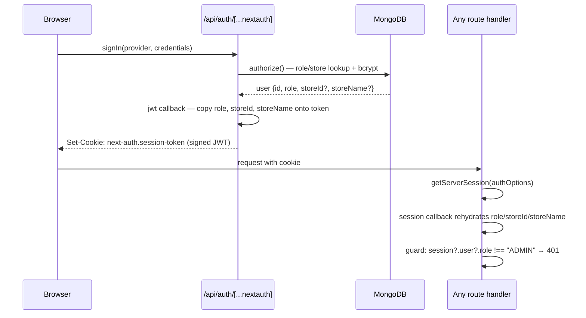
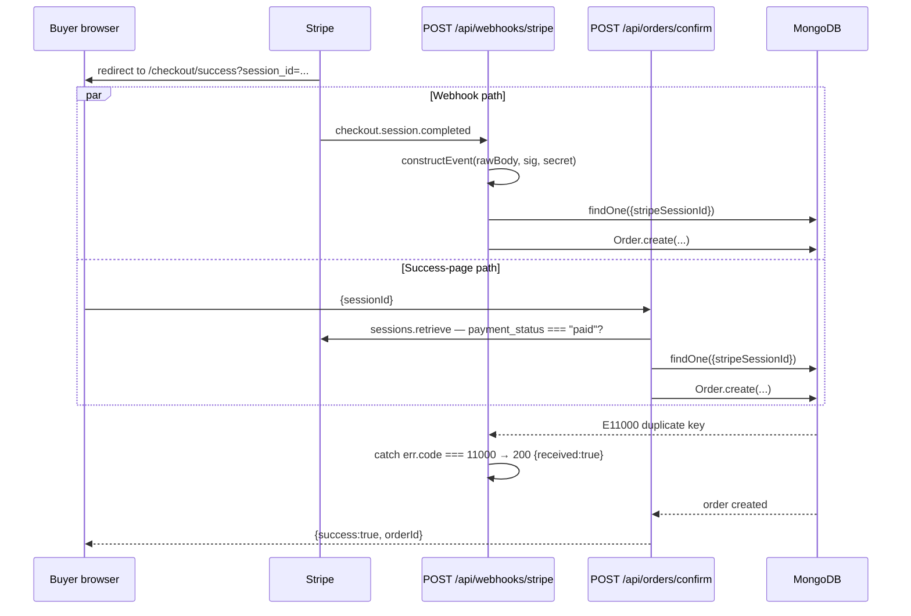

# 06 — API and Communication

> **SDLC stage:** 7. API / Communication
> **Status:** PARTIAL — contracts and idempotency are solid; validation is hand-rolled and rate limiting is narrow
> **Baseline:** commit `3eb178a`, 2026-08-16
> **Update when:** an endpoint is added, removed, or its contract changes.

This document supersedes `docs/API.md`, which is stale in a material way: it still
describes `/api/payments/checkout` as attaching a Connect split
(`application_fee_amount` + `transfer_data.destination`) at checkout time. That
behaviour was removed at this baseline — the full charge now lands on the platform
balance and the seller's share transfers only after buyer confirmation. See
`03-ARCHITECTURE` §4 and `04-DOMAIN` §4. `docs/API.md` also lists roughly half the
surface as "not yet verified".

At this document's baseline (`3eb178a`) the repository contained 54 `route.ts`
files under `src/app/api/`. **As of 2026-08-17 that is 53**: `GET
/api/dev/seed/products` — an unauthenticated production endpoint that wiped the
product catalogue, SEC-1 in `07-SECURITY` §1 — was deleted, and every reference to
it below has been removed accordingly. One of the remaining 53 is the NextAuth
catch-all (`/api/auth/[...nextauth]`), which is a framework handler rather than a
hand-written contract; the other **52 are first-party endpoints**. All 53 are
enumerated in §3.

---

## 1. API style and conventions

**Status: DONE.**

### 1.1 Style

REST-ish JSON over Next.js App Router route handlers. There is no separate backend
service — a route handler *is* the backend tier (`03-ARCHITECTURE` §3). Each
`route.ts` exports one function per HTTP verb it supports; Next.js returns `405` for
verbs a file does not export, so unsupported-method handling is free and uniform.

| Property | Decision |
|---|---|
| Transport | HTTPS only (Vercel terminates TLS) |
| Content type | `application/json` everywhere except `POST /api/upload` (`multipart/form-data`) and the Stripe webhook (raw body read via `req.text()`) |
| Response envelope | None. Success returns the resource or an ad-hoc object directly; errors return `{ error: string }` |
| Pagination | None, except `GET /api/admin/orders?limit=` and hard-coded caps (`/api/user/ai-history` limits to 20, `/api/admin/revenue` top-10 stores) |
| Hypermedia | None |
| Content negotiation | None |
| Compression, caching headers | Platform defaults; four routes explicitly set `Cache-Control: no-store` (`/api/categories`, `/api/admin/users`, `/api/store-owner/orders`, `/api/store-owner/products`) |

### 1.2 Why not GraphQL or gRPC

| Option | Why rejected |
|---|---|
| GraphQL | The only consumer is this application's own React tree, rendered from the same repository. Over-fetching is not a real cost here — the largest documents are a few kilobytes and the client is on the same CDN edge. A schema layer, resolvers, and an N+1 strategy would be added machinery maintained by one person for a problem that does not exist at 100 users |
| gRPC | Requires a service boundary. There is none; the "API" and the "client" are compiled into the same deployment |
| tRPC | Closest alternative, and it would have supplied the end-to-end typing that §4 identifies as missing. Rejected because it binds the client to the server's TypeScript, which would have to be undone the moment a non-TypeScript consumer (a native app, a partner integration) appears — and because Stripe's webhook must be a plain HTTP route regardless |

The honest summary: route handlers were chosen because they are the framework's default
and nothing about the workload justified leaving it. The cost is §4.

### 1.3 Resource naming

Plural nouns, kebab-case, nesting that mirrors ownership. Public catalogue routes
address items by `slug` (`/api/products/[slug]`); management routes address them by
Mongo `_id` (`/api/admin/attractions/[id]`); fulfilment addresses them by opaque token
(`/api/fulfill/[token]/confirm`). State transitions that are not pure resource writes
— `dispatch`, `confirm`, `report`, `decline`, `resolve`, `legal-refund` — are modelled
as verb sub-paths under the item they act on
(`/api/admin/disputes/[orderId]/items/[itemId]/resolve`) rather than as a `PATCH` on a
`status` field. This is deliberate: each carries side effects (a Stripe transfer, an
email, a token mint) that a generic field update would hide, and each has its own guard
set (`04-DOMAIN` §3.2).

### 1.4 Verb usage

73 verb handlers across the 54 files:

| Verb | Used for | Handlers |
|---|---|---|
| `GET` | Reads | 34 |
| `POST` | Creates, actions, webhook, auth | 24 |
| `PUT` | Full-ish updates (admin content, product edit, dispatch, ship) | 9 |
| `PATCH` | One route only: `/api/user/profile` | 1 |
| `DELETE` | Admin content deletion, store-owner product deletion | 4 |

`PUT` versus `PATCH` is not applied consistently. `PUT /api/store-owner/products/[id]`
overwrites a fixed field allow-list; `PUT /api/admin/attractions/[id]` does
`Object.assign(doc, body)`, which is partial-update semantics under a `PUT` verb. This
is cosmetic rather than harmful, but it is not a defensible convention.

### 1.5 Status codes actually used

Counted from the source at this baseline (occurrences of an explicit `status:`):

| Code | Occurrences | Meaning as used here |
|---|---|---|
| `200` | Default (plus 3 explicit) | Success. Explicit `200` is used on the three "do not leak existence" responses (§5) |
| `201` | 4 | Resource created — admin `POST` on attractions, local-experiences, bike-rentals, stores. Not used by `POST /api/store-owner/products`, which returns `200` |
| `400` | 45 | Validation failure, wrong state, missing parameter — all conflated |
| `401` | 55 | No session, wrong role, or wrong fulfilment PIN |
| `403` | 2 | Ownership failure where the resource is known to exist (`/api/ai/result`, `/api/store-owner/orders/[orderId]/ship`) |
| `404` | 31 | Not found, and also "found but not yours" in the ownership-scoped routes |
| `409` | 2 | Idempotency conflict — already resolved, already legally refunded |
| `429` | 4 | Rate limit (§7) and Gemini rate limit |
| `500` | 36 | Unhandled |

Two conventions are consistent, even if unusual. **`401` covers authorisation failures,
not just authentication failures** — a signed-in `STORE_OWNER` calling an admin route
gets `401`; `403` is reserved for the two cases where the caller is authenticated, the
resource exists, and it belongs to someone else. **`404` masks ownership** —
`PUT /api/store-owner/products/[id]` queries `{_id, storeId}` together, so another
store's product is indistinguishable from a non-existent one. Applied consistently in
the store-owner product routes and in `POST /api/orders/.../decline`.

---

## 2. Authentication and authorisation model

**Status: DONE.**

### 2.1 Providers

Three NextAuth v4 providers in `src/lib/auth.ts`, one session strategy (`jwt`), no
database session store.

| Provider id | Type | Credential | Check performed | Role issued |
|---|---|---|---|---|
| `google` | OAuth | Google account | On first sign-in, `signIn` callback upserts a `User` with `role: "USER"` and sends a welcome email | `USER` |
| `admin-login` | Credentials | `email` + `password` | Rate limit → `User.findOne({email}).select("+password +role")` → **`user.role !== "ADMIN"` returns null** → `bcrypt.compare` | `ADMIN` |
| `store-owner-login` | Credentials | `storeCode` + `password` | Rate limit → `Store.findOne({storeCode, role: "STORE_OWNER", active: true})` → `bcrypt.compare(password, store.passwordHash)` | `STORE_OWNER` |

Store owners authenticate against the `Store` collection, not `User`. A store is a
principal in its own right; there is no user-to-store membership join. One store, one
credential.

### 2.2 Token contents



The `jwt` callback copies `role`, `storeId` and `storeName` onto the token at sign-in;
the `session` callback copies them back onto `session.user`; every route guard reads
from that. A `trigger === "update"` branch lets the client refresh `role`, `name` and
`picture` after a profile edit. Two consequences: authorisation costs **no per-request
database lookup**, which is correct for a system where roles effectively never change;
and there is **revocation lag** — demoting an admin or deactivating a store does not
invalidate an issued token (`Store.active` is checked at login only, and the token lives
for NextAuth's default 30 days). Accepted risk at this scale; see `07-SECURITY` §3.

### 2.3 Authorisation matrix

Read from the actual guard in each handler. "Token-bearer" means a caller holding an
item's `fulfillmentToken` (a 24-byte `base64url` value minted per order item) or a
valid `stripe-signature`, with no session at all.

| Endpoint group | Anonymous | Signed-in `USER` | `STORE_OWNER` | `ADMIN` | Token-bearer |
|---|---|---|---|---|---|
| Public catalogue (`/api/products`, `/api/attractions`, `/api/local-experiences`, `/api/bike-rentals`, `/api/categories`, and their `[slug]` items) | Allowed | Allowed | Allowed | Allowed | n/a |
| `POST /api/contact` | Allowed (rate-limited) | Allowed | Allowed | Allowed | n/a |
| `POST /api/ai/preview` | **Denied** `401` | Allowed (credit-gated) | Allowed — role is not checked, only `session.user.email` | Allowed | n/a |
| `GET /api/ai/result` | **Denied** `401` | Owner only (`403` otherwise) | Only if the email matches | Only if the email matches | n/a |
| `POST /api/payments/checkout` | **Allowed — no session check at all** | Allowed | Allowed | Allowed | n/a |
| `POST /api/payments/ai-credits` | **Allowed — no session check at all** | Allowed | Allowed | Allowed | n/a |
| `POST /api/orders/confirm` | **Allowed** — authorisation is delegated to knowledge of a valid Stripe `session_id` | Allowed | Allowed | Allowed | n/a |
| `POST /api/user/credits/add` | Denied `401` | Allowed | Allowed | Allowed | n/a |
| `GET /api/orders` | Returns `[]` with `200` | Own orders only | Own orders only | Own orders only | n/a |
| `POST /api/orders/[orderId]/items/[itemId]/decline` | Denied `401` | Own order only (`404` otherwise) | Own order only | Own order only | n/a |
| `GET/POST /api/favorites`, `GET /api/favorites/check` | `401` on `/favorites`; `{favorited:false}` `200` on `/favorites/check` | Own favourites | Own favourites | Own favourites | n/a |
| `GET /api/user/*`, `PATCH /api/user/profile` | Denied `401` | Own data only | Allowed — guards check `session.user.email`, not role | Allowed | n/a |
| `POST /api/upload` | Denied `401` | **Allowed** — only `if (!session)` is checked | Allowed | Allowed | n/a |
| `/api/store-owner/*` (8 routes) | Denied `401` | Denied `401` | Allowed, scoped to `session.user.storeId` | **Denied `401`** — admins cannot use store-owner routes | n/a |
| `/api/admin/*` (16 routes) | Denied `401` | Denied `401` | Denied `401` | Allowed | n/a |
| `POST /api/fulfill/[token]/confirm` | n/a | n/a | n/a | n/a | Allowed with valid token **and** the store's `fulfillmentPin` |
| `POST /api/fulfill/[token]/report` | n/a | n/a | n/a | n/a | Allowed with valid token; **no PIN required** |
| `POST /api/webhooks/stripe` | Denied `400` without signature | — | — | — | Allowed with valid `stripe-signature` |
| `/api/auth/[...nextauth]` | Allowed (that is the point) | Allowed | Allowed | Allowed | n/a |

Three rows deserve emphasis and are carried into §10: the two unauthenticated payment
routes and the asymmetry that `report` needs no PIN
while `confirm` does. The last is intentional — reporting a problem moves money
nowhere and must stay possible for a courier who does not have the code — but it means
anyone holding a leaked token can move an item to `issue_reported` and force manual
admin resolution (`04-DOMAIN` §5).

Admin and store-owner *pages* are protected only by client-side guards
(`AdminGuard`, `StoreOwnerGuard`) inside `src/app/admin/layout.tsx` and
`src/app/store-owner/layout.tsx`. `src/proxy.ts` — the Next.js 16 middleware
equivalent, used here for locale rewriting — explicitly **excludes** `api`, `admin`
and `store-owner` from its matcher and performs no authorisation. All real enforcement
is the per-handler `getServerSession` check — 55 call sites across 37 route files. That
is the correct place for it, but the guard is copy-pasted with no shared helper, so a new
route that omits the check is protected by nothing.

---

## 3. Complete endpoint reference

**Status: DONE** for coverage; the reference itself is hand-maintained (§10).

Generic `500` rows are omitted per endpoint: an unhandled exception produces the
framework's `500`, and a `try/catch` handler produces `500 {error}`.

### 3.1 Public catalogue — 9 routes

| Method + path | Auth | Request | Success | Errors |
|---|---|---|---|---|
| `GET /api/products` | none | `?category` `?sort=price-asc\|price-desc\|name-asc\|name-desc` `?lang` | `200` array of products (`active:true`), `storeId` populated with `name,slug`, localised via `resolveLocalized` | `500` returns `[]` with status 500 |
| `GET /api/products/[slug]` | none | `?lang` | `200` product with populated store | `404 {error:"Product not found"}`. Note: does **not** filter on `active` |
| `GET /api/categories` | none | — | `200` `[{name,slug,image}]`, `Cache-Control: no-store`. Back-fills `Category` docs for legacy product category strings | none explicit |
| `GET /api/attractions` | none | `?category` `?featured=true` `?lang` | `200` array, `active:true`, sorted `order,title` | `500` returns `[]` |
| `GET /api/attractions/[slug]` | none | `?lang` | `200` attraction | `404` |
| `GET /api/local-experiences` | none | `?category` `?featured=true` `?lang` | `200` array | `500` returns `[]` |
| `GET /api/local-experiences/[slug]` | none | `?lang` | `200` experience | `404` |
| `GET /api/bike-rentals` | none | — | `200` array, `active:true` | `500 {error}` |
| `POST /api/contact` | none, rate-limited | `{name, email, topic?, message}` | `200 {ok:true}`, sends email via Resend | `400` missing field / bad email regex / `message > 3000` chars; `429` |

### 3.2 AI planner — 2 routes

| Method + path | Auth | Request | Success | Errors |
|---|---|---|---|---|
| `POST /api/ai/preview` | session | `{days, budget, people, dates, travelStyles, interests}` — **none of these are validated** | `200 {locked:false, id, response, remainingCredits}`. Calls Gemini **before** charging, then sets `freeUsed` or decrements `credits`, then persists `AIResponse` | `401`; `404` user not found; **`200 {locked:true, message:"Payment required"}`** when out of credits (not `402`); `429` on `AIRateLimitError`; `500` |
| `GET /api/ai/result` | session | `?id=` | `200` the `AIResponse` document | `400` missing id; `401`; `404`; `403` if `response.userEmail !== session.user.email` |

The credit gate is `user.freeUsed && user.credits <= 0`. Generation happens before the
charge so a provider failure never consumes a credit — a deliberate ordering, and the
mirror image of the guard-before-Stripe-call rule in §6.

### 3.3 Cart and payments — 3 routes

| Method + path | Auth | Request | Success | Errors |
|---|---|---|---|---|
| `POST /api/payments/checkout` | **none** | `{items:[{productId, variantId?, quantity}], deliveryType, address}` | `200 {url}` — pre-mints an `ObjectId` used as both the future `Order._id` and the PaymentIntent `transfer_group`; prices resolved server-side from the DB, never from the client; delivery fee read from the store; all context stuffed into `session.metadata` | **No validated error path.** Malformed input throws → `500` |
| `POST /api/payments/ai-credits` | **none** | no body | `200 {url}` — fixed €5.00 / 500 cents Checkout session, `metadata.type = "AI_CREDITS"` | `500` |
| `POST /api/user/credits/add` | session | `{sessionId}` | `200 {success:true}` — retrieves the Stripe session, requires `payment_status === "paid"`, dedupes on `Transaction.stripeSessionId`, `$inc` 5 credits, writes a `Transaction`, emails a receipt | `400` missing sessionId / not paid; `401`; `200 {success:true, message:"Already processed"}` on replay; `500` |

`POST /api/user/credits/add` does not verify that the Stripe session's
`metadata.type === "AI_CREDITS"`, nor that the session belongs to the calling user. Any
paid Checkout session id not already recorded in `Transaction` will mint five credits.
Carried to §10.

### 3.4 Orders (buyer) — 3 routes

| Method + path | Auth | Request | Success | Errors |
|---|---|---|---|---|
| `GET /api/orders` | session (soft) | — | `200` own orders, newest first | Anonymous receives `200 []`, not `401` |
| `POST /api/orders/confirm` | none | `{sessionId}` | `200 {success:true, orderId}` — the success-page path that races the webhook; verifies payment with Stripe, returns the existing order if present, otherwise creates it, decrements stock, sends confirmation | `400` missing sessionId / not paid; duplicate-key `11000` is caught and the winner's order returned; other errors rethrow → `500` |
| `POST /api/orders/[orderId]/items/[itemId]/decline` | session, buyer-owned | `{reasonCode, note?}` | `200 {success:true}` — sets `fulfillmentStatus = issue_reported`, records `issueReport.reportedBy = "buyer"` | `400` invalid `reasonCode` (allow-list of 4) or item not in `dispatched\|ready_for_pickup`; `401`; `404` order not found **or not owned**; `404` item not found |

### 3.5 Fulfilment (token-bearer) — 2 routes

| Method + path | Auth | Request | Success | Errors |
|---|---|---|---|---|
| `POST /api/fulfill/[token]/confirm` | token + store PIN, rate-limited | `{pin}` | `200 {valid:true, itemTitle}` — sets `delivered` or `picked_up`, then creates the item transfer and, if applicable, the delivery-fee transfer | `429`; `401 {valid:false, error:"Incorrect code"}` for missing/non-string/wrong PIN; **`200 {valid:false, error:"This confirmation link is no longer valid"}`** when the token does not match an item in a confirmable state (§5) |
| `POST /api/fulfill/[token]/report` | token only, rate-limited | `{reasonCode, note?}` | `200 {success:true}` — sets `issue_reported`, `reportedBy: "handler"`, `note` truncated to 500 chars | `429`; `400 {success:false, error:"Invalid reason"}`; `200 {success:false, ...}` for an unusable token |

A Stripe failure inside `confirm` does **not** fail the request. The item is still
marked delivered and `transferPending` / `transferError` are recorded on the item for
manual follow-up. Money-movement failure is decoupled from fulfilment truth
(`04-DOMAIN` §4.3).

### 3.6 Store owner — 8 routes

All require `session.user.role === "STORE_OWNER"`; all scope to `session.user.storeId`.

| Method + path | Request | Success | Errors |
|---|---|---|---|
| `GET /api/store-owner/products` | — | `200` own products, `no-store` | `401` |
| `POST /api/store-owner/products` | arbitrary body | `200` created product — **spreads `...body`** then forces `storeId` and `active:true` | `401` |
| `PUT /api/store-owner/products/[id]` | `{title, price, category, images, quantity, variants, active}` | `200` updated | `401`; `404` not found or not owned |
| `DELETE /api/store-owner/products/[id]` | — | `200 {success:true}` | `401`; `404` |
| `GET /api/store-owner/orders` | — | `200` orders containing this store's products, with items filtered to this store's, `no-store` | `401`; `500` |
| `PUT /api/store-owner/orders/[orderId]/ship` | — | `200 {success:true}` — legacy whole-order path; sets `status = shipped`, emails only for delivery orders | `401`; `404`; `400` if `order.paymentIntentId` exists (per-item flow); `403` if the store owns no item; `400` if status is not `paid` |
| `PUT /api/store-owner/orders/[orderId]/items/[itemId]/dispatch` | `{etaText}` | `200 {success:true}` — mints `fulfillmentToken`, sets `dispatched` or `ready_for_pickup`, emails the buyer the QR link | `400` empty/non-string `etaText`; `400` legacy order; `401`; `404` item not found or not owned; `400` item not `pending` |
| `POST /api/store-owner/connect` | — | `200 {url}` — creates or reuses a Stripe Express account (`country: "PT"`), returns an onboarding link | `401`; `404` store not found |
| `GET /api/store-owner/connect` | — | `200 {connected, onboardingComplete, commissionRate}` — self-heals onboarding state by re-reading the account from Stripe (§9) | `401`; `404` |
| `POST /api/store-owner/payouts` | — | `200 {url}` — Stripe Express dashboard login link | `401`; `400 {error:"Set up payouts first"}` |
| `POST /api/store-owner/categories` | `{name, image?}` | `200 {name, slug, image}` — upsert with `$setOnInsert` so a concurrent creator does not overwrite the image | `401`; `400` empty name |
| `PUT /api/store-owner/categories` | `{slug, image}` | `200 {name, slug, image}` | `401`; `400`; `404` |

(12 verb handlers across 8 route files.)

### 3.7 Admin — 16 routes

All require `session.user.role === "ADMIN"`, checked as
`session?.user?.role !== "ADMIN"` (or `!session || session.user?.role !== "ADMIN"` in
two files) → `401`.

| Method + path | Request | Success | Errors |
|---|---|---|---|
| `GET /api/admin/ai-settings` | — | `200` the `AI_SETTINGS` config value, lazily created with defaults | `401`; `500` |
| `PUT /api/admin/ai-settings` | arbitrary body | `200` stored value — **body written verbatim, no validation** | `401`; `500` |
| `GET /api/admin/config` | — | `200` the first `GlobalConfig` document | `401`; `500` — see §10, `GlobalConfig.create({})` violates the required `key` |
| `POST /api/admin/config` | `{defaultSystemPrompt?, defaultModel?, creditPrice?, freeCredits?}` | `200` config | `401`; `500`. These four fields are not in the `GlobalConfig` schema and are silently dropped by Mongoose strict mode |
| `GET /api/admin/attractions` | — | `200` all, including inactive | `401`; `500` |
| `POST /api/admin/attractions` | body with `{title, slug, ...}` | `201` created — whole body passed to `create()` | `400` missing title/slug or duplicate slug; `401`; `500` |
| `GET/PUT/DELETE /api/admin/attractions/[id]` | `PUT`: partial body | `200` | `401`; `404`; `400` slug collision on `PUT`; `500` |
| `GET /api/admin/bike-rentals` | — | `200` all | `401`; `500` |
| `POST /api/admin/bike-rentals` | `{name, coverImage, googleMapsUrl, ...}` | `201` | `400` missing required trio; `401`; `500` |
| `GET/PUT/DELETE /api/admin/bike-rentals/[id]` | `PUT`: partial body | `200` | `401`; `404`; `500` |
| `GET /api/admin/local-experiences` | — | `200` all | `401`; `500` |
| `POST /api/admin/local-experiences` | `{title, slug, ...}` | `201` | `400`; `401`; `500` |
| `GET/PUT/DELETE /api/admin/local-experiences/[id]` | `PUT`: partial body | `200` | `401`; `404`; `400`; `500` |
| `GET /api/admin/stores` | — | `200` stores, `passwordHash` and `fulfillmentPinHash` projected out | `401`; `500` |
| `POST /api/admin/stores` | `{name, storeCode, password, slug, location, deliveryFee?}` | `201` store, password bcrypt-hashed at cost 10 | `400` missing field or duplicate `storeCode`/`slug`; `401`; `500` |
| `GET /api/admin/stores/[id]` | — | `200` store minus secrets | `401`; `404` |
| `PUT /api/admin/stores/[id]` | `{name, location, deliveryFee, commissionRate, fulfillmentPin?}` | `200` store minus secrets; PIN re-hashed if a non-empty string | `400` missing name/location, `commissionRate` not a number in `[0,100]`, `deliveryFee` not a number `>= 0`; `401`; `404` |
| `GET /api/admin/users` | — | `200` users enriched with order/transaction/AI-plan aggregates, `no-store` | `401`; `500` |
| `GET /api/admin/orders` | `?limit=20` `?status=` | `200` orders with store name populated | `401`; `500` |
| `GET /api/admin/revenue` | — | `200 {totalRevenue, totalCommission, totalPayouts, revenueByStore[], dailyRevenue[], connectStatus[]}` over 60 days | `401`; `500` |
| `GET /api/admin/disputes` | — | `200` flattened list of every item in `issue_reported` | `401` |
| `POST /api/admin/disputes/[orderId]/items/[itemId]/resolve` | `{outcome:"seller_fault"\|"buyer_fault"\|"split", buyerPct?, sellerPct?, notes?}` | `200 {success:true, resolution}` — executes refunds/transfers, sets `resolved`, emails the buyer | `400` invalid outcome; `400` invalid split percentages; `400` store not Connect-onboarded (transfer outcomes); `401`; `404` order/item; **`409` already resolved**; `500` Stripe failure |
| `POST /api/admin/orders/[orderId]/items/[itemId]/legal-refund` | `{reason, amount?}` | `200 {success:true, legalException}` — reverses the transfer, then refunds the card | `400` missing reason, item never confirmed, no transfer exists, amount exceeds transferred; `401`; `404`; **`409` already processed**; `500` |

### 3.8 User account — 7 routes

| Method + path | Auth | Request | Success | Errors |
|---|---|---|---|---|
| `GET /api/user/credits` | session | — | `200 {credits, memberSince}` | `401` |
| `GET /api/user/transactions` | session | — | `200` own transactions | `401`; `500` |
| `GET /api/user/history` | session | — | `200` all own `AIResponse` documents | `401` |
| `GET /api/user/ai-history` | session | — | `200` last 20 own `AIResponse` documents | `401`; `500` |
| `PATCH /api/user/profile` | session | `{name?, image?}` | `200 {name, image}` — each field applied only if a non-empty trimmed string | `401`; `404` |
| `GET /api/favorites` | session | — | `200` hydrated favourite cards across four item types | `401` |
| `POST /api/favorites` | session | `{itemType, itemId}` | `200 {favorited:true\|false}` — toggle | `401`; `400` if `itemType` is not in the four-key `MODELS` map or `itemId` is falsy |
| `GET /api/favorites/check` | session (soft) | `?itemType&itemId` | `200 {favorited:boolean}` | Anonymous or missing params returns `200 {favorited:false}` |

`/api/user/history` and `/api/user/ai-history` return the same collection filtered the
same way; the only difference is the `limit(20)`. One of the two is redundant.

### 3.9 Webhooks, auth, upload, dev — 4 routes

| Method + path | Auth | Request | Success | Errors |
|---|---|---|---|---|
| `POST /api/webhooks/stripe` | `stripe-signature` | Raw Stripe event body | `200 {received:true}` (plus `orderId` when an order was created or found) | `400` missing signature; `400` signature verification failure; unhandled event types return `200 {received:true}`; non-`11000` DB errors rethrow so Stripe retries |
| `GET/POST /api/auth/[...nextauth]` | n/a | NextAuth protocol | NextAuth-defined | NextAuth-defined |
| `POST /api/upload` | any session | `multipart/form-data` with `file`, optional `folder` | `200 {url, publicId}` — streamed to Cloudinary under `gowithporto/<folder>` | `401`; `400` no file, non-`image/*` MIME, or `size > 10 MB` |

---

## 4. Request validation

**Status: PARTIAL — this is the weakest part of the API surface.**

### 4.1 The honest picture

There is **no schema validation library in the project**. `package.json` contains no
`zod`, `joi`, `yup`, `valibot` or `ajv`, and a source-wide search finds no reference to
one. Every validation in the API is hand-written inside the handler, using some mix of:

| Technique | Example |
|---|---|
| Truthiness check | `if (!title \|\| !slug) return 400` (`/api/admin/attractions`) |
| `typeof` guard | `typeof commissionRate !== "number"` (`/api/admin/stores/[id]`) |
| Numeric range | `commissionRate < 0 \|\| commissionRate > 100`; `buyerPct + sellerPct > 100` |
| Enum allow-list | `REASON_CODES.includes(reasonCode)`; `["seller_fault","buyer_fault","split"].includes(outcome)`; `MODELS[itemType]` as an implicit allow-list |
| Length truncation | `note.slice(0, 500)` in both issue-report routes |
| Regex | One only: the email pattern in `/api/contact` |
| Mongoose schema | `enum` on `fulfillmentStatus`, `deliveryType`, `resolution.outcome`; `required` on `Transaction` fields — the last line of defence, and the only one that is declarative |

### 4.2 Routes that validate well

These are the money-moving and state-changing routes, and the quality is not
accidental — they were written last and with the most care.

| Route | What it checks before acting |
|---|---|
| `POST /api/admin/disputes/.../resolve` | `outcome` against a 3-value allow-list; for `split`, that both percentages are numbers, non-negative, and sum to ≤ 100; that the item is still `issue_reported` (`409`); that the store can receive transfers |
| `POST /api/admin/orders/.../legal-refund` | `reason` is a non-empty trimmed string; item is `delivered` or `picked_up`; a transfer exists; no legal refund already processed (`409`); requested amount does not exceed what was transferred |
| `POST /api/orders/.../decline` | `reasonCode` allow-list; order ownership; item state in `dispatched\|ready_for_pickup`; note truncated |
| `POST /api/fulfill/[token]/report` | `reasonCode` allow-list; note truncated; token state constrained inside the query itself |
| `PUT /api/store-owner/orders/.../dispatch` | `etaText` present, string, non-empty after trim; order is a per-item order; item is owned by this store; item is `pending` |
| `PUT /api/admin/stores/[id]` | Required strings, typed and bounded numerics, and an explicit field allow-list documented in a comment — `storeCode`, `passwordHash`, `stripeAccountId` and `role` are deliberately unassignable through this route |
| `POST /api/contact` | Every field coerced through `typeof x === "string" ? x.trim() : ""`, email regex, 3000-character cap, rate limit |

### 4.3 Routes that accept whatever the client sends

| Route | Exposure |
|---|---|
| **`POST /api/payments/checkout`** | Destructures `{items, deliveryType, address}` from `req.json()` with **zero validation**. `items.map` on a missing or non-array `items` throws. `products[0].storeId` is read **without checking that the product query returned anything** — an empty cart, or `productId` values that match nothing, is an unhandled `TypeError` → `500`. `quantity` is passed to Stripe unchecked. `deliveryType` is not validated against the `pickup\|delivery` enum until Mongoose sees it much later, at order creation. `address` is `JSON.stringify`-ed into Stripe metadata and `JSON.parse`-ed back with no shape check |
| `POST /api/ai/preview` | Six fields destructured and passed straight into the prompt builder. No type, length or count checks. An arbitrarily long `interests` array becomes an arbitrarily long prompt |
| `POST /api/store-owner/products` | `Product.create({...body, storeId, active:true})` — any field the Mongoose schema accepts can be set by the client. Mitigated only by schema strictness |
| `PUT /api/admin/ai-settings` | Body stored verbatim as `GlobalConfig.value`, which is `Schema.Types.Mixed` — no constraint at all |
| `POST/PUT /api/admin/attractions`, `/api/admin/local-experiences`, `/api/admin/bike-rentals` | Presence checks on two or three fields, then the whole body is `create()`-ed or `Object.assign`-ed onto the document |
| `POST /api/user/credits/add` | `sessionId` presence only; no check that the Stripe session is an AI-credits session or belongs to the caller |
| `POST /api/favorites` | `itemType` is validated by map lookup, but `itemId` is only checked for truthiness — an arbitrary string is stored and simply fails to hydrate on read |

### 4.4 Quantified exposure

| Measure | Value |
|---|---|
| Route files / verb handlers | 54 / 73 |
| Handlers that read a request body | 29 |
| Of those, with at least one explicit validation branch | 21 |
| Of those, with **no** validation branch at all | 8 — `/api/payments/checkout`, `/api/ai/preview`, `POST /api/store-owner/products`, `PUT /api/admin/ai-settings`, `POST /api/admin/config`, and the three admin content `PUT [id]` handlers |
| Routes where an unvalidated body can cause an unhandled throw rather than a `4xx` | 1 confirmed: `/api/payments/checkout` |
| Routes where an unvalidated body can write attacker-chosen fields to the database | 5, all behind an `ADMIN` or `STORE_OWNER` session, bounded by Mongoose strict mode |

The material risk is concentrated in one endpoint. `/api/payments/checkout` is
unauthenticated, is the entry point to the money path, and validates nothing. It does
not permit price manipulation — prices and the delivery fee are re-read from the
database and the client's `price` field is ignored — which is the failure that would
actually matter. What it permits is `500`s from malformed input, and mis-attribution of
a multi-store cart (§10).

---

## 5. Error handling and response shape

**Status: PARTIAL.**

### 5.1 The convention

Failures return `{ error: "Human-readable message" }` with a `4xx`/`5xx` status;
successes return the resource, an array of resources, or `{ success: true }`. The error
shape is used by most route files and is applied consistently enough that a client can
rely on `res.ok === false → body.error is a string`.

### 5.2 Deliberate deviations

Three routes return `200` on what is logically a failure. Each is correct.

| Route | Response | Why `200` is right |
|---|---|---|
| `POST /api/fulfill/[token]/confirm` | `200 {valid:false, error:"This confirmation link is no longer valid"}` | A `404` here would confirm that a given token **does not** exist, while a `401` would confirm that it **does**. Because the token is the entire credential and the URL is handed to a courier or shown as a QR code, that difference is an oracle: an attacker enumerating tokens could separate live tokens from dead ones by status code alone and then only need the PIN. Returning `200` with the same body for "never existed", "already confirmed" and "already reported" collapses all three into one indistinguishable answer. The state guard is folded into the Mongo query (`fulfillmentStatus: {$in: ["dispatched","ready_for_pickup"]}`), so the handler cannot accidentally leak the distinction later |
| `POST /api/fulfill/[token]/report` | `200 {success:false, error:...}` | Same reasoning |
| `GET /api/favorites/check` | `200 {favorited:false}` for anonymous or missing params | Called on every product card render; a `401` would be noise, and "not favourited" is the truthful answer for a caller with no favourites |

`GET /api/orders` returning `200 []` to anonymous callers is a fourth deviation, but
unlike the three above it has no security rationale — it exists so the client does not
have to branch. `POST /api/ai/preview` returning `200 {locked:true}` instead of `402
Payment Required` is a fifth; `402` would be the more honest code.

### 5.3 Inconsistencies

| Inconsistency | Where |
|---|---|
| Error key varies | `{error}` mostly; `{valid:false, error}` in fulfil-confirm; `{success:false, error}` in fulfil-report |
| Success key varies | `{success:true}` / `{ok:true}` / bare resource / `{received:true}` (webhook) |
| Collection reads fail differently | `/api/products` and `/api/attractions` return `[]` **with status 500**, so a client checking `res.ok` sees a failure but a client checking the body sees an empty catalogue. `/api/bike-rentals` returns `{error}` with 500 for the same class of failure |
| Raw exception messages are surfaced | `catch (error: any) { return NextResponse.json({error: error.message}, {status:500}) }` appears in the admin content routes, leaking Mongoose validation and cast messages to the client |
| `401` vs `403` | §1.5 |
| Some handlers have no `try/catch` at all | `/api/orders/confirm`, `/api/payments/checkout`, `/api/fulfill/*`, `/api/admin/disputes` — an unexpected throw becomes the framework's generic `500` |

### 5.4 What is missing

- **No central error handler** — no shared `withAuth()` / `withErrorHandling()` wrapper;
  each handler repeats the pattern.
- **No error code taxonomy.** Errors are English strings, so a client can only branch on
  text or status. Tolerable while the sole client renders the string into a toast; a
  defect the moment a second consumer exists.
- **No correlation id and no structured logging** — `console.error` only. See
  `10-OPERATIONS` for what that costs during an incident.

---

## 6. Idempotency

**Status: DONE — the strongest part of the API.**

Every operation that moves money or creates an order is idempotent, at three layers.

### 6.1 Mechanism inventory

| # | Mechanism | Where | Protects against |
|---|---|---|---|
| 1 | Unique sparse index `Order.stripeSessionId` | `src/models/Order.ts` | Two orders for one Checkout session |
| 2 | Unique sparse index on `items.fulfillmentToken` | `src/models/Order.ts` | Token collision across items |
| 3 | Pre-minted `_id` — the order's `ObjectId` is generated at checkout and carried in `session.metadata.orderId` | `/api/payments/checkout` → `buildOrderFromStripeSession` | Divergent identifiers between the two creation paths; also gives the PaymentIntent a `transfer_group` equal to the order id |
| 4 | Read-before-create (`Order.findOne({stripeSessionId})`) | webhook and `/api/orders/confirm` | The common case of the race |
| 5 | Duplicate-key `11000` catch | webhook and `/api/orders/confirm` | The uncommon case — both paths passing the read check simultaneously |
| 6 | Stripe idempotency key `transfer:{orderId}:{itemId}` | `/api/fulfill/[token]/confirm`; `resolve` on `buyer_fault` | Double-paying a seller for one item |
| 7 | Stripe idempotency key `transfer:{orderId}:deliveryFee` | `confirm`; `resolve` on `buyer_fault` and `split` | Double-paying the delivery fee. Note the key is per **order**, not per item, which is what makes it safe to reference from three call sites |
| 8 | Stripe idempotency key `transfer:{orderId}:{itemId}:split` | `resolve` on `split` | A split transfer colliding with a full transfer for the same item |
| 9 | Stripe idempotency key `refund:{orderId}:{itemId}` | `resolve` on `seller_fault` | Double-refunding a buyer |
| 10 | Stripe idempotency key `refund:{orderId}:deliveryFee` | `resolve` on `seller_fault`, single-item orders | Double-refunding the fee |
| 11 | Stripe idempotency key `refund:{orderId}:{itemId}:split` | `resolve` on `split` | As above, for partial refunds |
| 12 | Stripe idempotency key `reversal:{transferId}` | `legal-refund` | Pulling a seller's funds back twice |
| 13 | Stripe idempotency key `legalrefund:{orderId}:{itemId}` | `legal-refund` | Double-refunding on the legal path |
| 14 | State guard `item.fulfillmentStatus !== "issue_reported"` → `409` | `resolve` | Re-resolving a dispute |
| 15 | State guard `item.legalException?.processedAt` → `409` | `legal-refund` | Re-processing a legal refund |
| 16 | State guard folded into the query — `fulfillmentStatus: {$in:["dispatched","ready_for_pickup"]}` | both `fulfill` routes | Re-confirming an already-confirmed item, which would fire a second transfer |
| 17 | State guard `item.fulfillmentStatus !== "pending"` → `400` | `dispatch` | Re-minting a fulfilment token, which would invalidate the QR already emailed |
| 18 | Boolean flag `order.deliveryFeeTransferred` | `confirm`, `resolve` | Paying the delivery fee once across multiple item confirmations |
| 19 | Read-before-write on `Transaction.stripeSessionId` | `/api/user/credits/add` | Double-crediting a credit purchase. **Weakest of the set** — see below |

### 6.2 Why guard-before-call ordering matters

Every state guard runs **before** the first Stripe call in its handler; the state write
runs **after** the Stripe call returns. That ordering is load-bearing. Called in this
order, a crash between the Stripe call and the save leaves the database showing the item
as unresolved — a retry is then safe, because the Stripe idempotency key deduplicates
the second call. Reversed — write local state, then call Stripe — a Stripe failure would
leave the item marked `resolved` with no money moved, and the `409` guard would block
every retry. That failure is **not** recoverable through the API; it needs a manual
database edit.

The two layers are therefore not redundant: the local guard makes retries cheap and
blocks the common case, and the Stripe key makes them *safe* in the window between
"Stripe accepted the call" and "we persisted that fact". The `resolve` handler states it
in a comment: *"Idempotency: an item can only be resolved once — reject before any
Stripe call."*

Mechanism 19 is the one incomplete case: `Transaction.stripeSessionId` is `required` but
**not uniquely indexed**, so the read-before-write is a check-then-act race with no
database backstop, and two simultaneous posts of the same `sessionId` can both credit the
user. Recorded in §10 and in `05-DATA` §4.

### 6.3 The webhook race



Either path may win. The loser catches `11000` and returns success. The buyer sees one
order; Stripe sees one `2xx`; stock is decremented once and one confirmation email is
sent, because both side effects sit on the create path inside the `try` block. This is
the mechanism `03-ARCHITECTURE` §4.2 describes.

---

## 7. Rate limiting

**Status: PARTIAL — narrow by design, and narrower than it should be.**

### 7.1 Implementation

`src/lib/rateLimit.ts` is 36 lines. A module-level `Map<string, {count, resetAt}>`, a
fixed window of **15 minutes**, a ceiling of **5 attempts** per key. `getClientIp`
takes the first entry of `x-forwarded-for`, falling back to the literal string
`"unknown"`. There is no cleanup sweep; entries are only overwritten when the same key
is seen again after expiry.

### 7.2 Where it is applied

| Call site | Key | Effect on limit |
|---|---|---|
| `admin-login` provider (`src/lib/auth.ts`) | `admin-login:{ip}:{email}` | `authorize` returns `null` → NextAuth reports a generic sign-in failure |
| `store-owner-login` provider | `store-owner-login:{ip}:{storeCode}` | Same |
| `POST /api/contact` | `contact:{ip}` | `429 {error:"Too many messages sent..."}` |
| `POST /api/fulfill/[token]/confirm` | `fulfill-confirm:{ip}:{token}` | `429 {valid:false, error}` |
| `POST /api/fulfill/[token]/report` | `fulfill-confirm:{ip}:{token}` | `429 {success:false, error}` |

Five call sites, four distinct key prefixes. `confirm` and `report` share the
`fulfill-confirm:` prefix, so they draw from one bucket per IP-token pair — five attempts
across both, not five each. That is the safer reading, though the code does not say it
was intended and it looks like a copy-paste.

### 7.3 What is not rate limited

**Everything else — the other 51 route files.** Named explicitly, because these are the
ones that matter:

| Unlimited endpoint | Why it matters |
|---|---|
| `POST /api/ai/preview` | Every call is a paid Gemini request. The only brake is the credit system: one free generation per user, then one credit each. So the *cost* is bounded per account — but account creation is free via Google OAuth, and there is no limit on how fast a single account may burn purchased credits, nor on concurrent requests from one session. The Gemini free tier's own 5-requests-per-minute ceiling is what actually caps throughput today, surfaced as `429` via `AIRateLimitError` after one 2-second retry |
| `POST /api/upload` | Authenticated, capped at 10 MB per file, **uncapped in frequency**. Any signed-in Google account can fill the Cloudinary quota |
| `POST /api/payments/checkout` | Unauthenticated. Each call creates a Stripe Checkout session — no cost, but it is an unauthenticated write to a third-party API |
| `POST /api/payments/ai-credits` | Same |
| `POST /api/orders/confirm` | Unauthenticated; each call is a Stripe `sessions.retrieve` |

### 7.4 Limitation of the mechanism

The counter is in-process memory on a serverless function instance, and Vercel runs
several instances and recycles them freely. The effective limit is therefore *5 per 15
minutes per instance*, not per deployment — with `n` warm instances the real ceiling is
`5n`, a cold start resets it to zero, and an IP-scoped key gives no protection against a
distributed attempt. That is adequate for the actual purpose: slowing a manual password-
or PIN-guessing attempt against a system with one admin, a handful of stores and 100
users over five years. It is not a defence against an automated attacker. Moving it to a
shared store (Upstash Redis, or Vercel's own primitive) is the documented next step; see
`07-SECURITY` §3 and `11-EVOLUTION`.

---

## 8. Versioning

**Status: OUT OF SCOPE — deliberately.**

There is no version prefix, no `Accept` header negotiation, no `?version=` parameter,
and no deprecation policy for endpoints. Nothing in the codebase mentions a version.

The reasoning:

| Condition for versioning | Present here? |
|---|---|
| More than one consumer | No. One Next.js client, in the same repository, deployed as the same artefact |
| Consumers that upgrade independently of the server | No. A deployment ships client and server atomically; there is no window in which an old client talks to a new server, apart from the seconds a stale tab survives |
| Third-party integrators | No. Nothing external calls these routes except Stripe, which calls one webhook whose contract Stripe controls, not us |
| A published or documented public API | No |
| A contract others could depend on unknowingly | No — same-origin `fetch` from first-party pages only |

Under those conditions a `/v1/` prefix would be ceremony: it would appear in 54 file
paths and every client call site, and would never be incremented. Breaking changes are
handled by changing both sides in one commit, which is what actually happens (see the
checkout-split removal at this baseline — server and client changed together).

**The condition that reverses this decision:** the first consumer that ships
independently of the web application. Concretely, either (a) a published API for
partners or a store-owner integration, or (b) a native mobile client, which sits in an
app store and cannot be force-upgraded, so an old binary will call the API for months
after a change. On either trigger, the minimum acceptable response is a `/api/v1/`
prefix introduced with the existing routes aliased, plus a written deprecation window.
Recorded in `11-EVOLUTION` §6.

---

## 9. Webhooks and events

**Status: PARTIAL.**

### 9.1 Inbound: `POST /api/webhooks/stripe`

The only inbound webhook, and the only endpoint authenticated by something other than a
session.

| Step | Behaviour |
|---|---|
| Raw body | `await req.text()` — must not be parsed as JSON first, or the signature will not verify |
| Signature | `stripe.webhooks.constructEvent(body, signature, process.env.STRIPE_WEBHOOK_SECRET)` |
| Missing header | `400 {error:"Missing signature"}` |
| Verification failure | Logged, `400 {error:"Invalid signature"}` |
| Unhandled event type | `200 {received:true}` — Stripe stops retrying |
| Errors that are not `11000` | Rethrown, producing a `500`, so Stripe retries with backoff |

Two event types are handled:

| Event | Action |
|---|---|
| `checkout.session.completed` | Ignores non-`paid` sessions; checks for an existing order; re-retrieves the session with `line_items` and the expanded PaymentIntent; builds the order via `buildOrderFromStripeSession`; creates it; decrements stock; emails confirmation. `11000` → the success page won the race, return `200` |
| `account.updated` | `Store.findOneAndUpdate({stripeAccountId}, {stripeOnboardingComplete: charges_enabled && payouts_enabled})` |

### 9.2 The Connect-scoped endpoint requirement

`account.updated` is a **Connect event**. Stripe does not deliver Connect events to a
standard account webhook endpoint; the Dashboard requires a second endpoint explicitly
configured to listen to "events on connected accounts". Both may point at the same URL,
but the second registration must exist, and it is a separate operational step that is
easy to omit. If it is omitted, `stripeOnboardingComplete` never flips, a store that
Stripe has fully approved is permanently treated as un-onboarded, every transfer to it
is skipped and every item is marked `transferPending` — a silent, money-affecting
failure caused by a Dashboard checkbox. `GET /api/store-owner/connect` compensates:

```ts
if (store.stripeAccountId && !store.stripeOnboardingComplete) {
  const account = await stripe.accounts.retrieve(store.stripeAccountId);
  const onboardingComplete = !!(account.charges_enabled && account.payouts_enabled);
  if (onboardingComplete !== store.stripeOnboardingComplete) { /* persist */ }
}
```

The store owner's dashboard polls this route, so the state self-heals the next time the
owner opens the page, whether or not the webhook was ever configured, and the
`!store.stripeOnboardingComplete` condition keeps the extra Stripe call off the hot path
afterwards. Same defence-in-depth shape as §6.3: a push mechanism that is usually fast,
plus a pull mechanism that is always correct.

### 9.3 Outbound webhooks and internal events

| Capability | Status |
|---|---|
| Outbound webhooks to third parties | **None.** No subscription model, no delivery queue, no signing key issuance |
| Internal event bus / pub-sub | **None** |
| Background job queue | **None** |
| Scheduled jobs / cron | **None** |

All coordination is direct function calls inside a request. `PUT .../dispatch` mints the
token, saves, then `await`s `sendOrderDispatchedForOrder` before responding; the webhook
`await`s `decrementStockForOrder` and `sendOrderConfirmationForOrder` before returning
`200` to Stripe. Consequences:

- An email-provider outage fails the *whole request*, not just the notification. In the
  webhook that returns `500`, Stripe retries, the retry hits the `stripeSessionId`
  guard and returns cleanly — the order is safe, the email may be lost. In `dispatch` a
  Resend failure throws after the order has been saved with a minted token, so the item
  is dispatched but the buyer never receives the QR link, with no retry.
- Nothing can be deferred. There is no way to schedule "chase unconfirmed deliveries
  after 7 days", which `04-DOMAIN` §6 identifies as a missing domain rule.
- The upside is no queue to operate, no dead-letter handling, and no eventual-consistency
  reasoning for one person to maintain.

The eight `send*` entry points in `src/lib/email.ts` are the whole outbound surface:
order confirmation, shipped, dispatched, ready-for-pickup, dispute resolved, credit
receipt, welcome, contact-form relay.

---

## 10. Known API gaps

| # | Gap | Severity | Evidence | Planned response |
|---|---|---|---|---|
| 1 | **No schema validation library.** All validation is hand-rolled per route; no `zod`/`joi`/`yup`/`ajv` in `package.json` or the source | High | §4 | Adopt `zod` at the eight unvalidated body handlers first, starting with checkout |
| 2 | **`/api/payments/checkout` validates nothing and is unauthenticated.** `products[0].storeId` is read without checking the query returned any product; an empty or bogus `items` array is an unhandled `TypeError` → `500` | High | `src/app/api/payments/checkout/route.ts` | Validate `items` shape and non-emptiness; return `400` |
| 3 | **Checkout assumes a single-store cart.** `storeId` is taken from `products[0]` alone and written to `session.metadata.storeId`. A cart spanning two stores is attributed entirely to the first product's store — wrong commission snapshot, wrong delivery fee, wrong store dashboard, and transfers routed to the wrong Connect account. Nothing in the cart UI or the API enforces one store per cart | High | `checkout/route.ts`; `src/app/checkout/page.tsx` posts the whole Redux cart | Either enforce single-store carts at the API (`400` on mixed carts) or split into one order per store |
| ~~4~~ | ~~**`/api/dev/seed/products` was unguarded and shipped in the production build.**~~ **RESOLVED 2026-08-17** — the route and `src/lib/seedProducts.ts` were both deleted | Was Critical | — | Deleted rather than guarded, since nothing else called it |
| 5 | **`/api/payments/ai-credits` is unauthenticated** and creates Stripe sessions with no caller identity | Medium | `payments/ai-credits/route.ts` | Require a session |
| 6 | **`/api/user/credits/add` does not bind the Stripe session to the caller or to the credits product.** No check on `metadata.type === "AI_CREDITS"`, no check that the session was paid by this user. Any paid session id not already in `Transaction` mints 5 credits | Medium | `user/credits/add/route.ts` | Verify metadata and customer email; add a unique index on `Transaction.stripeSessionId` |
| 7 | **No rate limiting on expensive endpoints.** `/api/ai/preview` and `/api/upload` are unlimited (§7.3) | Medium | `src/lib/rateLimit.ts` call sites | Per-user limit on AI generation and upload |
| 8 | **Rate limiter is per-instance in-memory** — the real ceiling is `5 × warm instances`, and a cold start resets it | Medium | §7.4 | Move to a shared store when traffic justifies it |
| 9 | **No documented or enforced request size limits.** Only `/api/upload` checks a size (10 MB), and it does so *after* `req.formData()` has already materialised the upload in memory. No JSON body cap anywhere; the platform default is the only limit and it is not documented | Medium | `upload/route.ts` | Document the platform limit; add explicit caps on the JSON routes |
| 10 | **No CORS policy.** No `Access-Control-*` headers are set anywhere and `next.config.mjs` configures none, so the browser default (same-origin for credentialed requests) is the entire policy. This is the correct posture today, but it is implicit — nothing records that it was chosen | Low | repository-wide search | Record it; add an explicit deny if a public API is ever introduced |
| 11 | **No OpenAPI or contract artefact.** §3 is the only contract, it is hand-written, and nothing verifies it against the code. `docs/API.md` demonstrates exactly this failure mode — it described the pre-baseline Connect-split checkout for two days after the behaviour changed | High | `docs/API.md` vs `payments/checkout/route.ts` | Generate an OpenAPI document from `zod` schemas once gap 1 is closed, so the contract derives from the code rather than tracking it |
| 12 | **`GET /api/admin/config` throws when no config document exists.** It calls `GlobalConfig.create({})`, but the schema declares `key` as `required` and `unique` — the create fails validation, the `catch` fires, and the route returns `500`. `POST /api/admin/config` writes four fields (`defaultSystemPrompt`, `defaultModel`, `creditPrice`, `freeCredits`) that are not in the schema and are silently dropped by Mongoose strict mode | Medium | `admin/config/route.ts`, `src/models/GlobalConfig.ts` | Model the fields properly or remove the route |
| 13 | **AI settings are stored but never read.** `/api/admin/ai-settings` persists `model: "gpt-4-turbo"`, `temperature`, `maxTokens` and a system prompt; `/api/ai/preview` hard-codes its own system prompt and `geminiProvider.ts` pins `gemini-3.7-flash`. The admin screen implies control it does not have | Medium | `admin/ai-settings/route.ts` vs `ai/preview/route.ts`, `services/ai/geminiProvider.ts` | Wire it up or remove the screen |
| 14 | **`GET /api/products/[slug]` does not filter on `active`**, unlike the list route — a deactivated product remains directly reachable by URL | Low | `products/[slug]/route.ts` | Add `active: true` |
| 15 | **Raw exception messages returned to clients** in the admin content routes (`error.message`) | Low | `admin/attractions/[id]`, `admin/local-experiences/[id]`, `admin/bike-rentals/[id]`, `admin/config` | Map to generic messages, log the detail |
| 16 | **No shared auth helper.** The role guard is copy-pasted into roughly 40 handlers; a new route that omits it is unprotected with no signal | Medium | every route file | Extract `requireAdmin()` / `requireStoreOwner()` wrappers |
| 17 | **No contract tests.** Nothing exercises any endpoint. `09-QUALITY` §3 specifies the endpoint tests that should exist; none do | High | absence of any test runner | Per `09-QUALITY` |
| 18 | **`console.log` left in production handlers** (`/api/store-owner/orders`, `/api/user/credits/add`), including a Stripe session id | Low | those files | Remove or route through structured logging |

---

## Trade-offs recorded

**Hand-rolled validation bought speed and cost consistency, and the bill is concentrated
in one endpoint.** The routes written most recently and with the most care — dispute
resolution, legal refunds, dispatch, item decline — validate thoroughly, with enum
allow-lists, numeric bounds and truncation; the routes written earliest validate nothing.
That distribution tracks when each route was written and how much money it touches, which
is a defensible prioritisation everywhere except that the earliest route is
`/api/payments/checkout`, which is unauthenticated and sits at the head of the money path.
The least-validated endpoint is one of the most exposed. Adopting `zod` there is under an
hour of work; the honest reason it has not happened is that the code works for the carts
the first-party client actually produces, and "works for the inputs our own client sends"
has been the implicit contract throughout. That contract holds exactly as long as the
first-party client is the only caller — which is also the argument for skipping
versioning in §8. One assumption underwrites both decisions, so both fail together.

**Idempotency was engineered to a standard the rest of the API does not reach, and the
asymmetry is correct.** Nineteen mechanisms across three layers — unique indexes, Stripe
idempotency keys, and state guards ordered before every Stripe call — is disproportionate
to 100 users and proportionate to the consequence. A duplicated transfer pays a seller
twice from the platform's own balance; a duplicated refund pays a buyer twice. Neither is
recoverable by retrying; both require the operator to notice and unwind manually through
the Stripe Dashboard. The failure mode of weak validation on the same path is a `500` and
a buyer who tries again. Effort went where failure is irreversible rather than where it
is merely visible. The one incomplete case, `/api/user/credits/add`, is where the
consequence is smallest — an over-credited account costs a few Gemini calls. That the gap
sits where the stakes are lowest is a reasonable outcome, though it was not reasoned at
the time.

**Direct function calls instead of an event bus removed an operational surface and made
email delivery part of the request's fate.** No queue, no worker, no dead-letter handling,
no eventual-consistency reasoning — for one operator with no on-call rotation that is a
large saving, and it is the same reasoning that put the whole system in one deployment
(`03-ARCHITECTURE` §2). The price is specific: `dispatch` saves the order with a minted
fulfilment token and then awaits Resend, so a provider outage leaves an item dispatched
whose buyer never received the QR link, with no retry and no record of the failure. The
buyer can still see the item state on their own orders page, so the email is not the sole
channel — but that is a mitigation discovered after the fact, not a design. A queue is the
textbook answer and the wrong answer at this scale; the right answer is a persisted
`emailStatus` per notification plus a manual resend action, which is one field and one
admin button rather than a piece of infrastructure.

**Skipping versioning is defensible only because of a property the project is actively
trying to lose.** §8 rests entirely on there being one consumer that ships atomically with
the server, which makes a `/v1/` prefix pure ceremony today. That property disappears the
moment a mobile client or partner integration arrives, and it disappears silently —
nothing in the build fails, nothing warns, and the first symptom is an old app-store
binary calling a contract that changed. Hence the explicit reversal condition rather than
a bare absence. The same condition applies to gap 11: no OpenAPI artefact is tolerable
while this document is the only contract and one person reads it, and untenable as soon as
someone else integrates against it. `docs/API.md` already demonstrated how fast a
hand-maintained reference drifts — two days, on the most financially sensitive route in
the system. This document will drift the same way unless the contract is generated from
the code, which is why gaps 1 and 11 are one piece of work and not two.
