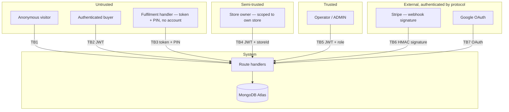

# 07 — Security and Privacy

> **SDLC stage:** 8. Security
> **Status:** PARTIAL — authentication, authorisation and money-path integrity are sound; the one critical finding is resolved, but unrotated credentials and no security monitoring remain
> **Baseline:** commit `3eb178a`, 2026-08-16
> **Update when:** a trust boundary moves or a new threat is identified.

---

## 1. Open findings

Findings identified during the documentation audit of 2026-08-16, ordered by
severity. Each carries a CVSS-style qualitative rating, not a computed score.

### SEC-1 — CRITICAL — Unauthenticated destructive endpoint in production — RESOLVED

`GET /api/dev/seed/products` was deployed to production, required no
authentication, had no role check, and was not guarded by environment. It called
`seedProducts()`, which executed:

```ts
await Product.deleteMany({});   // src/lib/seedProducts.ts (deleted)
```

**Impact.** A single unauthenticated HTTP GET could destroy the entire product
catalogue for every store on the platform. Because Atlas M0 provides no
continuous backup (`05-DATA` §7), there was no restore path — the loss would
have been permanent.

**Reachability.** Worse than an ordinary unguarded route, for three reasons.
The path was guessable and, since the repository is public, also documented. The
verb was `GET`, so it could be triggered without an attacker at all — a crawler,
a link-preview bot, a browser prefetch or a chat-client URL unfurl was
sufficient. And `NODE_ENV` appears nowhere in `src/`, so the route's behaviour in
production was identical to its behaviour locally.

**Remediation applied 2026-08-17.** Deleted `src/app/api/dev/seed/` and the
now-unused `src/lib/seedProducts.ts` in their entirety. The legitimate need —
seeding a local database — is already served by `scripts/create-admin.js` and
the other maintenance scripts in `scripts/`, which run against an explicit
connection string rather than over HTTP.

**Status: RESOLVED (2026-08-17).** Was the highest-priority item in the entire
project, ahead of the launch-gate items in `01-PRODUCT` §9.3.

### SEC-2 — HIGH — Credentials exposed in setup screenshots remain unrotated

The Gemini API key, the Google OAuth client secret and the Cloudinary API secret
all appeared in screenshots taken during infrastructure setup. Rotation was
deferred by the founder on 2026-08-05 and has not occurred.

**Impact.** Gemini key: unmetered use of the project's AI quota and, once billing
is enabled, unbounded cost. OAuth client secret: with the client ID, an attacker
could impersonate the application in an OAuth flow. Cloudinary secret: read,
write and delete against the media library.

**Remediation.** Rotate all three at their respective consoles, update Vercel
environment variables and `.env.local`, redeploy. Approximately thirty minutes.
Rotation should be treated as mandatory whenever a credential has been rendered
to a screen that was captured, regardless of where the capture went.

**Status: OPEN — deferred by founder.**

### SEC-3 — MEDIUM — Unauthenticated, unvalidated payment session creation

`POST /api/payments/checkout` and `POST /api/payments/ai-credits` take no session
and validate no input.

**Impact.** Not exploitable for free goods: the resulting order's identity comes
from Stripe's `customer_details`, and credits are only granted by an
authenticated route that verifies payment status. The realistic impact is
resource abuse — an anonymous caller can create unlimited Stripe Checkout Sessions
— and an unhandled 500 when `items` is empty or malformed, because the route
indexes `products[0].storeId` without checking the array.

**Remediation.** Require a session on both routes. Validate `items` as a non-empty
array of `{ productId, quantity, variantId? }`. Reject a cart spanning more than
one store explicitly rather than silently attributing it to the first product's
store (`04-DOMAIN` §6).

**Status: OPEN.**

### SEC-4 — MEDIUM — Stripe session not bound to the paying user

`POST /api/user/credits/add` authenticates the caller, verifies with Stripe that
the session was paid, and deduplicates on `stripeSessionId` — but never checks
that the session belongs to the caller. Credits are granted to whoever presents
the session ID.

**Impact.** A user who obtains another user's Checkout Session ID can claim their
credits. The ID is delivered only in the payer's own redirect URL, so practical
exploitability is low, but the authorisation check is genuinely absent.

**Remediation.** Compare `stripeSession.customer_details.email` against
`session.user.email`, or set the buyer's email into the session metadata at
creation and verify it on redemption.

**Status: OPEN.**

### SEC-5 — LOW — No dependency vulnerability scanning

No Dependabot configuration, no `npm audit` in any pipeline (there is no
pipeline). Nineteen production dependencies including Stripe, Mongoose and NextAuth
are updated only when something breaks.

**Remediation.** A `.github/dependabot.yml` with weekly npm updates is a
seven-line file. See `09-QUALITY` §5.

**Status: OPEN.**

### Findings closed before this baseline

Recorded because the reasoning is part of the security history.

| Finding | Resolution |
|---|---|
| `POST /api/orders` and `POST /api/payments/success` created a "paid" order from client-submitted data with no Stripe verification. Not called by any UI, but live and directly callable — any signed-in user could `curl` themselves a free order | **Deleted**, not fixed, since nothing used them (ADR 2026-08-03) |
| Google-authenticated customers had no `User` document, silently breaking the credit gate | `signIn` callback now creates the record |
| Seller was paid at checkout, before delivery, leaving no funds under platform control to honour a refund | Replaced with confirmation-gated settlement (`04-DOMAIN` §4.1) |
| `Store.stripeOnboardingComplete` could be stuck `false` permanently because `account.updated` requires a separately-registered Connect webhook endpoint | Self-healing check added to `GET /api/store-owner/connect` |

---

## 2. Trust boundaries and threat model

### 2.1 Trust boundaries



| ID | Boundary | Control | Assessment |
|---|---|---|---|
| TB1 | Anonymous → public API | None required; read-only catalogue | Sound, **except** SEC-1 and SEC-3 sit here |
| TB2 | Buyer → own resources | NextAuth JWT; every route re-derives ownership from `session.user.email` | Sound |
| TB3 | Handler → fulfilment action | 192-bit random token (buyer-held) + bcrypt PIN (store-held) | Sound by design; see §4 |
| TB4 | Store owner → own store's data | JWT carries `storeId`; product ownership re-derived server-side, never trusted from the client | Sound |
| TB5 | Operator → everything | `session.user.role === "ADMIN"` checked per route | Sound, but no second factor — see §3.3 |
| TB6 | Stripe → webhook | `stripe.webhooks.constructEvent` HMAC verification, rejecting unsigned and mis-signed payloads | Sound |
| TB7 | Google → identity | Standard OAuth 2.0 authorisation code flow via NextAuth | Sound |

### 2.2 STRIDE analysis

| Threat | Scenario | Control | Residual |
|---|---|---|---|
| **Spoofing** | Forged Stripe webhook creating fake paid orders | HMAC signature verification with the endpoint secret | Low |
| **Spoofing** | Store owner impersonation by brute-forcing a store code | bcrypt hashes; rate limit 5 attempts / 15 min per IP+code | Medium — the limiter is per serverless instance (§5.3) |
| **Spoofing** | Handler confirming a handover that never happened | Requires both the buyer's token and the store's PIN | Low, assuming PIN hygiene (§4) |
| **Tampering** | Client submitting a manipulated price at checkout | Prices are read server-side from the database; the client sends only product and variant IDs and quantities | Low |
| **Tampering** | Client altering the commission rate | Rate read from `Store`, snapshotted server-side, never accepted from a request | Low |
| **Tampering** | Direct write to the catalogue | Admin/store-owner guards on every mutating route — **except SEC-1** | **Critical until SEC-1 is closed** |
| **Repudiation** | Operator denies a dispute resolution | `Resolution` records `resolvedBy`, `resolvedAt`, amounts and Stripe IDs | Low |
| **Repudiation** | Seller denies receiving a transfer | Stripe transfer IDs persisted on the item; `transfer_group` groups the order | Low |
| **Repudiation** | No general audit log of administrative actions | Money actions are recorded; catalogue and user edits are not | Medium — accepted |
| **Information disclosure** | Enumerating valid fulfilment tokens | Invalid, expired and non-existent tokens return one identical generic message; rate-limited | Low |
| **Information disclosure** | Cross-store data leakage | Store-owner routes filter by `session.user.storeId`, re-deriving the product set server-side | Low |
| **Information disclosure** | Secrets in the client bundle | Cloudinary and Stripe secret operations execute server-side only; no secret is prefixed `NEXT_PUBLIC_` | Low |
| **Information disclosure** | Credentials in screenshots | — | **Open: SEC-2** |
| **Denial of service** | Brute force on login | Rate limiter | Medium (§5.3) |
| **Denial of service** | AI quota exhaustion by one user | Credit system caps generations per account; no per-IP limit on the endpoint itself | Medium |
| **Denial of service** | Unlimited Stripe session creation | None | **Open: SEC-3** |
| **Denial of service** | Catalogue destruction | None | **Open: SEC-1** |
| **Elevation of privilege** | User self-promotes to ADMIN | `role` is set server-side in the `signIn` callback and read from the JWT, never accepted from a request body | Low |
| **Elevation of privilege** | Store owner acting on another store's order | `storeId` from the JWT; item ownership verified against that store's products | Low |
| **Elevation of privilege** | Claiming another user's credits | — | **Open: SEC-4** |

---

## 3. Authentication and authorisation

### 3.1 Authentication

Three NextAuth v4 providers, JWT session strategy, no server-side session store.

| Provider | Identity | Credential | Rate limited |
|---|---|---|---|
| `google` | Customer | OAuth 2.0; `signIn` callback creates the `User` on first login and sends the welcome email | By Google |
| `admin-login` | Operator | Email + password; bcrypt; requires `User.role === "ADMIN"` | Yes — IP + email |
| `store-owner-login` | Store owner | Store code + password; bcrypt against `Store.passwordHash`; requires `active: true` | Yes — IP + store code |

Role, `storeId` and `storeName` are written onto the JWT at sign-in and surfaced
through the session callback. Profile updates propagate via NextAuth's `update()`
trigger rather than requiring re-authentication.

### 3.2 Authorisation

Enforced per route handler. There is no middleware-level authorisation layer —
`src/proxy.ts` handles locale only and explicitly excludes `/api`, `/admin` and
`/store-owner` from its matcher.

| Actor | May |
|---|---|
| Anonymous | Read the public catalogue; create a checkout session (SEC-3); confirm an order against a Stripe session ID |
| Buyer | Everything anonymous, plus: generate itineraries, buy credits, read own orders/history/favourites/transactions, edit own profile, report an issue on own order item |
| Handler (token + PIN) | Confirm or report against one specific order item |
| Store owner | Manage own products and categories; view own orders; dispatch own items; open Connect onboarding; open own payout dashboard |
| Operator (ADMIN) | Everything: full catalogue, all stores, all users, all orders, revenue, dispute resolution, legal-exception refunds |

Two properties worth noting. **Client-supplied identifiers are never trusted for
authorisation** — the store-owner dispatch route re-queries the caller's product
set from `session.user.storeId` and checks membership, rather than accepting a
`storeId` from the request. And **UI hiding is never the control**: separate route
trees per audience mean an unauthorised control is absent rather than concealed
(`02-UX` §1).

### 3.3 Gaps in the authentication design

| Gap | Assessment |
|---|---|
| No second factor on the ADMIN account | The single most privileged credential in the system — it can refund, transfer and reverse — is protected by a password alone. Accepted for now, but poor; NextAuth credentials providers make TOTP awkward, which is a reason and not a justification |
| No password complexity or rotation policy | Admin and store-owner passwords are set manually with no enforced minimum |
| No account lockout, only rate limiting | And the limiter is per-instance (§5.3) |
| No session revocation | JWT sessions cannot be invalidated server-side before expiry; a compromised token remains valid |
| No audit log of administrative actions | Money actions are recorded on the order; catalogue, store and user edits leave no trail |

---

## 4. The fulfilment credential design

The most unusual security decision in the system, and the one most likely to be
questioned.

**The design.** Each order item carries a `fulfillmentToken` —
`crypto.randomBytes(24)` rendered base64url, so 192 bits of entropy, unique and
sparse-indexed. The buyer holds it as a QR code. Each store holds a
`fulfillmentPinHash` — a bcrypt hash of a short PIN, deliberately distinct from
the store's login code so it can be handed to a courier without granting portal
access (BR-12). A handover requires both.

**Why not require handler accounts.** Stronger attribution, certainly. Also a
guarantee that a courier standing on a pavement skips the flow entirely — at which
point settlement never fires and the whole escrow model collapses. The platform
accepted weaker attribution in exchange for a flow a stranger will actually
complete.

**What the design does buy.** The two secrets are held by parties with opposing
incentives. A buyer cannot confirm receipt of goods they never got; a seller
cannot self-confirm to release their own funds. That opposition is what makes the
confirmation meaningful, and it is a stronger property than a single trusted
credential would provide.

**Residual risk.** A store's PIN is a store-level secret. If it leaks — a courier
photographs it, a former employee retains it — that party can falsely confirm any
handover for that store, releasing funds early. Mitigations in place: the token is
still required, so an attacker needs a specific buyer's QR as well; attempts are
rate-limited per IP and token; every confirmation is timestamped on the item.
Mitigations not in place: no PIN rotation mechanism, no per-handover
one-time code, no alert on an unusual confirmation rate.

**Accessibility note that is also a security note.** A buyer who cannot present a
QR code cannot complete a handover, and their money remains in escrow indefinitely
(`02-UX` §7). The obvious remedy — showing the buyer a code they can read aloud —
weakens the two-party property. This tension is unresolved and should be designed
deliberately rather than left to whichever concern is raised first.

---

## 5. Controls in place

### 5.1 Input handling

| Control | Coverage |
|---|---|
| Injection resistance | Mongoose casts query parameters to schema types, which blocks the common operator-injection shapes. No raw query construction anywhere |
| XSS | React escapes by default. `dangerouslySetInnerHTML` appears three times, all in `[slug]/layout.tsx` files injecting `JSON.stringify`d JSON-LD into a `<script>` tag — server-generated structured data, not user input |
| Enum allow-lists | Dispute reason codes, resolution outcomes, fulfilment statuses and delivery types are constrained at the route and in the schema |
| Length bounds | Dispute notes truncated to 500 characters |
| Price integrity | Prices always read server-side from the database |
| File upload | Server-side only; credentials never reach the client |

**The gap:** validation is hand-rolled per route rather than schema-driven. There
is no `zod`, `joi` or equivalent. The dispute, decline, report, dispatch and
legal-refund routes validate carefully; `/api/payments/checkout` validates
nothing. The quality of validation therefore varies by how much attention a given
route received on the day it was written, which is exactly the property a schema
library exists to remove. See `06-API` §4.

### 5.2 Secrets management

Eleven secrets, held in Vercel environment variables in production and
`.env.local` locally. `.env.local` is git-ignored and has never been committed —
verified against the repository history. No secret carries a `NEXT_PUBLIC_`
prefix, so none reaches the client bundle.

Three are known-exposed and unrotated (SEC-2). There is no rotation schedule, no
secret manager, and no separation between development and production credentials
beyond Stripe's test/live key distinction.

One decision worth recording: the Stripe key exposed to AI tooling during
development is a **restricted, test-mode-only** key. A `sk_test_`/`rk_test_` key
is structurally incapable of touching live financial data regardless of how a
tool's permissioning behaves, and Stripe's restricted-key granularity narrows it
further to the specific operations the application uses. Giving an autonomous
agent access to a financial account needs a boundary that does not depend on the
agent behaving well.

### 5.3 Rate limiting

`src/lib/rateLimit.ts`: an in-memory `Map`, fixed window, 5 attempts per 15
minutes, keyed by client IP plus the target identifier.

Applied to: admin login, store-owner login, fulfilment confirm, fulfilment report,
contact form. **Not applied to** anything else, including `/api/ai/preview` (money
per call, though credit-gated), `/api/upload`, and the payment session routes.

The limitation is structural and was accepted knowingly: under serverless the
`Map` lives in one instance's memory, resets on cold start and is not shared
across concurrent instances. It stops naive brute-force scripts, which is what it
was built for. It would not stop a distributed attempt. The remedy — Upstash Redis
— was deferred as an additional account and service for a problem the system does
not yet have (ADR 2026-08-03), with the trigger recorded in `11-EVOLUTION` §5.

### 5.4 Transport and infrastructure

TLS everywhere, terminated at Vercel with managed certificates. DNS on Cloudflare.
Database access over TLS to Atlas.

**Gap:** the Atlas M0 network access list is not documented in this repository and
should be confirmed to be restricted rather than open to `0.0.0.0/0` — a
convenience setting during setup that is easy to leave in place. Verification is
in `TODO.md`.

**Gap:** no security headers are configured. `next.config.mjs` sets image remote
patterns only. There is no Content-Security-Policy, no `Strict-Transport-Security`,
no `X-Frame-Options`, no `Referrer-Policy`. For an application handling payments
this is a real omission, and it is a configuration change rather than a
refactor.

---

## 6. OWASP Top 10 (2021) mapping

| Risk | Status | Evidence |
|---|---|---|
| A01 Broken access control | **PARTIAL** | Route-level guards are consistent and re-derive ownership server-side. **SEC-1, SEC-3, SEC-4 are all instances of this category** |
| A02 Cryptographic failures | PARTIAL | bcrypt for passwords and PINs; TLS everywhere; no card data stored. No encryption at rest beyond Atlas defaults; no field-level encryption on addresses |
| A03 Injection | LOW RISK | Mongoose casting; React escaping; no raw query building |
| A04 Insecure design | PARTIAL | The settlement design is deliberate and defensible. The absence of any handover timeout (`04-DOMAIN` §6) is a design gap with financial consequences |
| A05 Security misconfiguration | **WEAK** | No security headers; no CSP; SEC-1 is a misconfiguration in the literal sense; Atlas network list unverified |
| A06 Vulnerable components | **WEAK** | No scanning, no update policy — SEC-5 |
| A07 Identification and authentication failures | PARTIAL | Sound providers and hashing; no MFA on ADMIN; per-instance rate limiting; no session revocation |
| A08 Software and data integrity failures | PARTIAL | Webhook signatures verified; pinned AI model version. No CI, no signed builds, no lockfile-integrity gate |
| A09 Logging and monitoring failures | **ABSENT** | `console.*` only, no aggregation, no alerting, no security event logging. A successful attack would leave no trace an operator would see. See `10-OPERATIONS` §4 |
| A10 Server-side request forgery | LOW RISK | No user-supplied URL is fetched server-side |

---

## 7. Privacy

### 7.1 Personal data inventory

| Data | Collection | Source | Purpose | Retention |
|---|---|---|---|---|
| Email | `User`, `Order`, `AIResponse`, `Transaction`, `Favorite` | Google OAuth or checkout | Identity, order association, receipts | **Undefined** |
| Display name, avatar URL | `User` | Google OAuth or user edit | Personalisation | **Undefined** |
| Delivery address | `Order.address` | Checkout form | Fulfilment | **Undefined** |
| Card brand, last 4 | `Order`, `Transaction` | Stripe | Receipt display | **Undefined** |
| Trip preferences — dates, budget, group size, interests | `AIResponse.prompt` | Planner form | Generation and history | **Undefined** |
| IP address | Transient, rate-limiter keys | Request headers | Abuse prevention | Until instance recycles |

No card numbers, no CVV, no bank details are stored — Stripe holds all of it, and
seller bank details never touch the platform.

### 7.2 Sub-processors

Stripe (payments, EU/US), MongoDB Atlas (data, EU `eu-west-3`), Vercel (hosting,
US company with EU edge), Cloudinary (media), Resend (email), Google (OAuth and
Gemini). **No data processing agreement has been reviewed or signed with any of
them**, and the transfer mechanism for US-based processors has not been assessed.

### 7.3 Privacy gaps

| Gap | Implication |
|---|---|
| No defined retention period for any personal data | Contravenes GDPR's storage-limitation principle |
| No data-subject access or erasure mechanism | Articles 15 and 17 require both; neither exists in code or process |
| No consent management or cookie banner | The session cookie is arguably strictly necessary, but this has not been assessed |
| No processing register, no DPIA | Article 30 obligations |
| Privacy policy exists as a page but has not been legally reviewed | Its accuracy against actual processing is unverified |
| Itinerary prompts are sent to Google Gemini | A third-country transfer of personal data that no notice discloses |

**The last row is the most exposed.** A user's trip dates, group composition and
interests are personal data, they are transmitted to a third-party AI provider,
and nothing in the interface tells them so. All of this is scoped in
`12-GOVERNANCE` §2 and requires Portuguese legal input, not more engineering.

---

## 8. Remediation plan

| Priority | Action | Effort | Blocks launch |
|---|---|---|---|
| 1 | ~~Delete `src/app/api/dev/seed/` (SEC-1)~~ | Minutes | **Done 2026-08-17** |
| 2 | Rotate the three exposed credentials (SEC-2) | 30 min | **Yes** |
| 3 | Add security headers — CSP, HSTS, frame options, referrer policy | 1 hour | Yes |
| 4 | Verify the Atlas network access list is restricted | 15 min | Yes |
| 5 | Require a session and validate input on both payment routes (SEC-3) | 1 hour | Yes |
| 6 | Bind the Stripe session to the paying user in `credits/add` (SEC-4) | 30 min | Yes |
| 7 | Add `dependabot.yml` and `npm audit` to CI (SEC-5) | 30 min | No |
| 8 | Introduce schema validation at trust boundaries | 1 day | No |
| 9 | Error tracking, so an attack leaves a visible trace (A09) | Half a day | Yes |
| 10 | MFA on the ADMIN account | Half a day | No |
| 11 | Define retention periods and a subject-erasure procedure | 1 day + legal | **Yes** |

Items 1 and 2 should be done today. Items 3–6 and 9 are a single focused session.

---

## Trade-offs recorded

**Managed identity over custom authentication.** NextAuth brings an opinionated
session model, an awkward path to MFA, and no server-side revocation. It also
means the project has not hand-rolled password hashing, session tokens or OAuth
state handling — the three places small teams most reliably introduce
vulnerabilities. The trade is correct, and the MFA gap is its real cost.

**Two shared secrets over per-person credentials at handover.** Accepts that the
system knows *a* PIN-holder confirmed, not *who*. Buys a flow that a courier
completes without an account, which is the difference between the escrow model
working and not existing. Revisit the moment a false confirmation is observed.

**Rate limiting that is knowingly incorrect.** An in-memory limiter under
serverless is not a distributed limiter, and the project documented that rather
than implying otherwise. Choosing a partial control and labelling it accurately
is better practice than choosing none — but it is worse practice than the
fifteen minutes Upstash would have cost, and the honest reading is that this was
cost discipline shading into avoidance.

**Feature delivery ahead of a security review.** SEC-1 has been live in
production since the earliest commits and was found by an audit, not by a
process — because no process existed to find it. A dependency scan, a route
inventory with an auth column, or any CI security step would have surfaced it
months ago. The controls this system does have are good; the *practice* of
looking for what it lacks was absent, and that is the more important finding.
